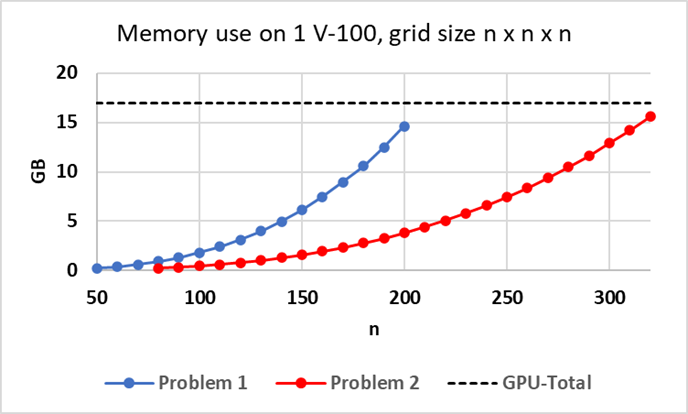
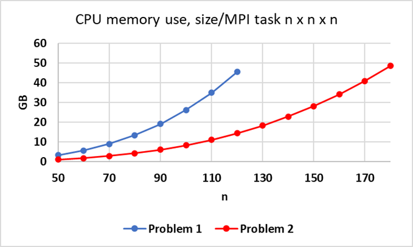

*******
AMG2023
*******

This is the documentation for Benchmark - parallel algebraic multigrid solver for 3D diffusion problems. 

Purpose
=======

The AMG2023 benchmark consists of a driver (amg.c), a simple Makefile, and documentation. It is available at https://github.com/LLNL/AMG2023 . 
It requires an installation of hypre 2.27.0. 
It uses hypre's parallel algebraic multigrid (AMG) solver BoomerAMG in combination with a Krylov solver to solve 
two linear systems arising from diffusion problems on a cuboid discretized by finite differences. 
The problems are set up through hypre's linear-algebraic IJ interface. The problem sizes can be controlled from the command line.`. 

Characteristics
===============

Problems
--------

* Problem 1 (default): The default problem is a 3D diffusion problem on a cuboid with a 27-point stencil.  It is solved with AMG-GMRES(100). 

* Problem 2 (-problem 2): This problem solves a 3D Laplace problem on a cuboid with a 7-point stencil.  It is solved with AMG-PCG using one level of aggressive coarsening. 

The problem sizes for both problems can be set by the user from the command line.

Figure of Merit
---------------

The figures of merit (FOM_setup and FOM_solve) are calculated using the total number of nonzeros for all system matrices and interpolation operators on all levels of AMG, AMG setup wall clock time (FOM_setup), and AMG solve phase time and number of iterations (FOM_solve). 
FOM_setup and FOM_solve are qualitatively different. FOM_solve represents a number in the order of the throughput of an average iteration in the solve phase, i.e., approximately flops times a constant. FOM_setup is more complex, since the setup phase also contains many integer computations and if statements to generate data structures, determine neighbor processes, etc.  All of this is already available in the solve phase. For this reason, we will report both below.

The total FOM is evaluated as follows:   FOM = (FOM_setup + FOM_solve)/2.

Building
========

The AMG2023 benchmark uses a simple Makefile system for building the driver.

It requires an installation of hypre 2.27.0, which can be downloaded from https://github.com/hypre-space/hypre via

   ``git clone -b v2.27.0 https://github.com/hypre-space/hypre.git``

Information on how to install hypre is available here: https://hypre.readthedocs.io/en/latest/ 

Depending on the machine and desired programming models, different configurations are needed.
hypre configure options can be obtained by typing

   ``./configure --help``

in hypre's src directory.

When using CPUs only, hypre generally can be installed by typing

   ``./configure;``
   ``make install``

in the src directory.

If OpenMP threading within MPI tasks is desired, it should be configured as follows:

   ``./configure --with-openmp --enable-hopscotch``

If hypre should be run on Nvidia GPUs:

   ``./configure --with-cuda`` 

or 

   ``./configure --with-cuda --with-device-memory-pool``

to use the memory pool option included with hypre.

If hypre is to be run on AMD GPUs:

.. code-block:: bash

   ./configure --with-hip --with-gpu-arch=gfx90a 
   --with-MPI-lib-dirs="${MPICH_DIR}/lib" --with-MPI-libs="mpi" 
   --with-MPI-include="${MPICH_DIR}/include" 
..

If the problem to be run is larger than 2 billion, i.e., Px*Py*Pz*nx*ny*nz is larger than 2 billion, 
where Px*Py*Pz is the total number of MPI tasks and nx*ny*nz the local problem sizeper MPI task, hypre needs to be configured with 

   ``--enable-mixed-int``

since it requires 64-bit integers for some global variables. By default, hypre uses 32-bit integers.

To build the code, first modify the 'Makefile' file appropriately, 

then type

  ``make``

Other available targets are

.. code-block:: bash

  make clean       (deletes .o files)
  make distclean   (deletes .o files, libraries, and executables)
..

Running
=======

The driver for AMG2023 is called 'amg'. Type

   ``amg -help``

to get usage information.  This prints out the following:

Usage: 

.. code-block:: bash

 amg [<options>]
 
   -problem <ID>: problem ID
       1 = solves 1 problem with AMG-PCG (default) 
       2 = solves 1 problem AMG-GMRES(100)

  -n <nx> <ny> <nz>: problem size per MPI process (default: nx=ny=nz=10)

  -P <px> <py> <pz>: processor topology (default: px=py=pz=1)

  -print       : prints the system
  -printstats  : prints preconditioning and convergence stats
  -printallstats  : prints preconditioning and convergence stats
                    including residual norms for each iteration
..

All arguments are optional.  A very important option for AMG2023 is the '-P' option. 
It specifies the MPI process topology on which to run, requiring a total of  <Px>*<Py>*<Pz> MPI processes.  

The '-n' option allows one to specify the local problem size per MPI process, leading to a global problem size of <Px>*<nx> x <Py>*<ny> x <Pz>*<nz>.

Example Scalability Results 
===========================

To measure strong scalability, it is important to change the size per process with the process topology:

The following results were achieved on RZTopaz for a 3D 7-pt Laplace problem on a 300 x 300 x 300 grid.

   ``srun -n <P*Q*R> amg -P 
 <Q> <R> -n <nx> <ny> <nz> -problem 2``

.. table:: Strong scaling on RZTopax: MPI only
   :align: center

   +------------+---------------+------------+------------+
   | P x Q x R  |  nx x ny x nz | setup time | solve time |
   +------------+---------------+------------+------------+
   | 1 x 1 x 1  |  300x300x300  |   43.37    |    61.85   |
   +------------+---------------+------------+------------+
   | 2 x 1 x 1  |  150x300x300  |   31.06    |    42.09   |
   +------------+---------------+------------+------------+
   | 2 x 2 x 1  |  150x150x300  |   15.68    |    22.74   |
   +------------+---------------+------------+------------+
   | 2 x 2 x 2  |  150x150x150  |    8.44    |    12.59   |
   +------------+---------------+------------+------------+
   | 4 x 2 x 2  |    75x150x150 |    5.37    |     8.39   |
   +------------+---------------+------------+------------+
   | 4 x 4 x 2  |    75x 75x150 |    2.70    |     6.80   |
   +------------+---------------+------------+------------+
   

.. table:: Strong scaling on RZTopaz: MPI with 4 OpenMP threads per MPI task
   :align: center

   +------------+---------------+------------+------------+
   | P x Q x R  |  nx x ny x nz | setup time | solve time |
   +------------+---------------+------------+------------+
   | 1 x 1 x 1  |  300x300x300  |   17.56    |    20.81   |
   +------------+---------------+------------+------------+
   | 2 x 1 x 1  |  150x300x300  |   12.04    |    14.48   |
   +------------+---------------+------------+------------+
   | 2 x 2 x 1  |  150x150x300  |    6.35    |     8.78   |
   +------------+---------------+------------+------------+
   | 2 x 2 x 2  |  150x150x150  |    3.14    |     6.84   |
   +------------+---------------+------------+------------+
   | 4 x 2 x 2  |   75x150x150  |    2.44    |     6.73   |
   +------------+---------------+------------+------------+

Memory Usage
============

AMG2023's memory needs are somewhat complicated to describe.  They are very dependent on the type of problem solved and the options used.  When turning on the '-printstats' option, memory complexities <mc> are displayed, which are defined by the sum of non-zeroes of all matrices (both system matrices and interpolation matrices on all levels) divided by the number of non-zeroes of the original matrix, i.e., at least about <mc> times as much space is needed.  However, this does not include memory needed for communication, vectors, auxiliary computations, etc. 

The figure below provides information about approximate memory usage on 1 NVIDIA V-100 for Problem 1 (AMG-GMRES, 27pt stencil) and Problem 2 (AMG-PCG, 7pt stencil, with 1 level aggressive coarsening) for increasing problem sizes n x n x n, starting at 0.24 GB for each problem.
The black dashed line indicates the GPU memory available on 1 GPU (V-100) on Lassen. 

The second figure provides memory use on 1 node of CTS-1 (Quartz) using 4 MPI tasks with 9 OpenMP threads each for Problem 1 and Problem 2 for increasing problem size n x n x n per MPI task. 

   
   Approximate memory use for Problems 1 and 2 on V-100

   
   Approximate memory use for Problems 1 and 2 on CTS-1

Strong Scaling on Crossroads
----------------------------

We present strong scaling results for varying problem sizes on Crossroads with HBM below. The code was configured and compiled using hypre v2.29.0 with MPI only and optimization -O2.

Strong scaling results of AMG2023 for problem 1 on a grid size of 120 x 120 x 120 are provided in the following table and figure.

.. csv-table:: AMG2023 Strong Scaling for Problem 1 (27-pt, AMG-GMRES) on a grid of size 120 x 120 x 120
   :file: roci_1_120.csv
   :align: center
   :widths: 10, 10, 10
   :header-rows: 1

.. figure:: roci_1_120.png
   :align: center
   :scale: 50%
   :alt: AMG2023 Strong Scaling for Problem 1 (27-pt, AMG-GMRES) on a grid of size 120 x 120 x 120
   
   AMG2023 Strong Scaling for Problem 1 (27-pt, AMG-GMRES) on a grid of size 120 x 120 x 120

Strong scaling results of AMG2023 for problem 1 on a grid size of 160 x 160 x 160 are provided in the following table and figure.

.. csv-table:: AMG2023 Strong Scaling for Problem 1 (27-pt, AMG-GMRES) on a grid of size 160 x 160 x 160
   :file: roci_1_160.csv
   :align: center
   :widths: 10, 10, 10
   :header-rows: 1
   

.. figure:: roci_1_160.png
   :align: center
   :scale: 50%
   :alt: AMG2023 Strong Scaling for Problem 1 (27-pt, AMG-GMRES) on a grid of size 160 x 160 x 160
   
   AMG2023 Strong Scaling for Problem 1 (27-pt, AMG-GMRES) on a grid of size 160 x 160 x 160
   

Strong scaling results of AMG2023 for problem 1 on a grid size of 200 x 200 x 200 are provided in the following table and figure.

.. csv-table:: AMG2023 Strong Scaling for Problem 1 (27-pt, AMG-GMRES) on a grid of size 200 x 200 x 200
   :file: roci_1_200.csv
   :align: center
   :widths: 10, 10, 10
   :header-rows: 1
   

.. figure:: roci_1_200.png
   :align: center
   :scale: 50%
   :alt: AMG2023 Strong Scaling for Problem 1 (27-pt, AMG-GMRES) on a grid of size 200 x 200 x 200
   
   AMG2023 Strong Scaling for Problem 1 (27-pt, AMG-GMRES) on a grid of size 200 x 200 x 200
   

Strong scaling results of AMG2023 for problem 2 on a grid size of 200 x 200 x 200 are provided in the following table and figure.

.. csv-table:: AMG2023 Strong Scaling for Problem 2 (7-pt, AMG-PCG) on a grid of size 200 x 200 x 200
   :file: roci_2_200.csv
   :align: center
   :widths: 10, 10, 10
   :header-rows: 1
   

.. figure:: roci_2_200.png
   :align: center
   :scale: 50%
   :alt: AMG2023 Strong Scaling for Problem 2 (7-pt, AMG-PCG) on a grid of size 200 x 200 x 200
   
   AMG2023 Strong Scaling for Problem 2 (7-pt, AMG-PCG) on a grid of size 200 x 200 x 200
   

Strong scaling results of AMG2023 for problem 2 on a grid size of 256 x 256 x 256 are provided in the following table and figure.

.. csv-table:: AMG2023 Strong Scaling for Problem 2 (7-pt, AMG-PCG) on a grid of size 256 x 256 x 256
   :file: roci_2_256.csv
   :align: center
   :widths: 10, 10, 10
   :header-rows: 1
   

.. figure:: roci_2_256.png
   :align: center
   :scale: 50%
   :alt: AMG2023 Strong Scaling for Problem 2 (7-pt, AMG-PCG) on a grid of size 256 x 256 x 256
   
   AMG2023 Strong Scaling for Problem 2 (7-pt, AMG-PCG) on a grid of size 256 x 256 x 256
   

Strong scaling results of AMG2023 for problem 2 on a grid size of 320 x 320 x 320 are provided in the following table and figure.

.. csv-table:: AMG2023 Strong Scaling for Problem 2 (7-pt, AMG-PCG) on a grid of size 320 x 320 x 320
   :file: roci_2_320.csv
   :align: center
   :widths: 10, 10, 10
   :header-rows: 1
   

.. figure:: roci_2_320.png
   :align: center
   :scale: 50%
   :alt: AMG2023 Strong Scaling for Problem 2 (7-pt, AMG-PCG) on a grid of size 320 x 320 x 320
   
   AMG2023 Strong Scaling for Problem 2 (7-pt, AMG-PCG) on a grid of size 320 x 320 x 320

Approximate results of the FOM for varying memory usages on Crossroads are provided in the following table and figure. Note that the actual size in GB is only an estimate.

.. csv-table:: Varying memory usage for Problem 1 and 2
   :file: roci_mem.csv
   :align: center
   :widths: 10, 10, 10
   :header-rows: 1
   

.. figure:: roci_mem.png
   :align: center
   :scale: 50%
   :alt: Varying memory usage (estimate) for Problem 1 and 2
   
   Varying memory usage (estimated) for Problem 1 and 2

V-100
-----

We have also performed runs on 1 NVIDIA V-100 GPU increasing the problem size n x n x n.
For these runs hypre 2.27.0 was configured as follows:

``configure --with-cuda``

We increased n by 10 starting with n=50 for Problem 1 and with n=80 for Problem 2 until we ran out of memory. 
Note that Problem 2 uses much less memory, since the original matrix has at most 7 coefficients per row vs 27 for Problem 1. 
In addition, aggressive coarsening is used on the first level, significantly decreasing memory usage at the cost of increased number of iterations.

.. table:: FOMs, times and number of iterations for Problem 1 with grid size n x n x n on 1 V-100 

 +---------+-----------+-----------+-----------+------------+------------+------------+
 |    n    |    FOM    | FOM_setup | FOM_solve | setup time | solve time | iterations |
 +---------+-----------+-----------+-----------+------------+------------+------------+
 |   50    | 2.652E+09 | 9.708E+07 | 5.304E+09 |   0.068    |   0.024    |    19      |
 +---------+-----------+-----------+-----------+------------+------------+------------+
 |   60    | 3.586E+09 | 1.348E+08 | 7.172E+09 |   0.086    |   0.031    |    19      |
 +---------+-----------+-----------+-----------+------------+------------+------------+
 |   70    | 4.670E+09 | 1.504E+08 | 9.340E+09 |   0.123    |   0.038    |    19      |
 +---------+-----------+-----------+-----------+------------+------------+------------+
 |   80    | 4.482E+09 | 2.000E+08 | 8.964E+09 |   0.139    |   0.059    |    19      |
 +---------+-----------+-----------+-----------+------------+------------+------------+
 |   90    | 5.878E+09 | 2.190E+08 | 1.176E+10 |   0.181    |   0.064    |    19      |
 +---------+-----------+-----------+-----------+------------+------------+------------+
 |  100    | 6.439E+09 | 2.702E+08 | 1.288E+10 |   0.202    |   0.080    |    19      |
 +---------+-----------+-----------+-----------+------------+------------+------------+
 |  110    | 6.704E+09 | 3.026E+08 | 1.341E+10 |   0.240    |   0.103    |    19      |
 +---------+-----------+-----------+-----------+------------+------------+------------+
 |  120    | 7.013E+09 | 3.359E+08 | 1.403E+10 |   0.281    |   0.128    |    19      |
 +---------+-----------+-----------+-----------+------------+------------+------------+
 |  130    | 7.192E+09 | 3.709E+08 | 1.438E+10 |   0.324    |   0.159    |    19      |
 +---------+-----------+-----------+-----------+------------+------------+------------+
 |  140    | 7.230E+09 | 3.907E+08 | 1.446E+10 |   0.385    |   0.198    |    19      |
 +---------+-----------+-----------+-----------+------------+------------+------------+
 |  150    | 7.425E+09 | 4.108E+08 | 1.485E+10 |   0.451    |   0.237    |    19      |
 +---------+-----------+-----------+-----------+------------+------------+------------+
 |  160    | 7.525E+09 | 4.255E+08 | 1.505E+10 |   0.528    |   0.284    |    19      |
 +---------+-----------+-----------+-----------+------------+------------+------------+
 |  170    | 7.593E+09 | 4.372E+08 | 1.519E+10 |   0.617    |   0.338    |    19      |
 +---------+-----------+-----------+-----------+------------+------------+------------+
 |  180    | 7.656E+09 | 4.429E+08 | 1.531E+10 |   0.724    |   0.398    |    19      |
 +---------+-----------+-----------+-----------+------------+------------+------------+
 |  190    | 7.669E+09 | 4.526E+08 | 1.534E+10 |   0.834    |   0.468    |    19      |
 +---------+-----------+-----------+-----------+------------+------------+------------+
 |  200    | 7.728E+09 | 4.593E+08 | 1.546E+10 |   0.959    |   0.542    |    19      |
 +---------+-----------+-----------+-----------+------------+------------+------------+

.. table:: FOMs, times and number of iterations for Problem 2 with grid size n x n x n on 1 V-100 

 +---------+-----------+-----------+-----------+------------+------------+------------+
 |    n    |    FOM    | FOM_setup | FOM_solve | setup time | solve time | iterations |
 +---------+-----------+-----------+-----------+------------+------------+------------+
 |   80    | 2.669E+09 | 5.841E+07 | 5.280E+09 |   0.096    |   0.032    |    30      |
 +---------+-----------+-----------+-----------+------------+------------+------------+
 |   90    | 3.063E+09 | 6.953E+07 | 6.057E+09 |   0.115    |   0.038    |    29      |
 +---------+-----------+-----------+-----------+------------+------------+------------+
 |  100    | 3.481E+09 | 8.562E+07 | 6.876E+09 |   0.135    |   0.047    |    30      |
 +---------+-----------+-----------+-----------+------------+------------+------------+
 |  110    | 3.831E+09 | 9.717E+07 | 7.564E+09 |   0.153    |   0.060    |    31      |
 +---------+-----------+-----------+-----------+------------+------------+------------+
 |  120    | 3.693E+09 | 1.068E+08 | 7.279E+09 |   0.178    |   0.081    |    31      |
 +---------+-----------+-----------+-----------+------------+------------+------------+
 |  130    | 4.375E+09 | 1.126E+08 | 8.636E+09 |   0.215    |   0.087    |    31      |
 +---------+-----------+-----------+-----------+------------+------------+------------+
 |  140    | 4.547E+09 | 1.284E+08 | 8.967E+09 |   0.236    |   0.105    |    31      |
 +---------+-----------+-----------+-----------+------------+------------+------------+
 |  150    | 4.753E+09 | 1.448E+08 | 9.361E+09 |   0.257    |   0.127    |    32      |
 +---------+-----------+-----------+-----------+------------+------------+------------+
 |  160    | 4.879E+09 | 1.598E+08 | 9.600E+09 |   0.273    |   0.150    |    32      |
 +---------+-----------+-----------+-----------+------------+------------+------------+
 |  170    | 4.985E+09 | 1.685E+08 | 9.801E+09 |   0.322    |   0.183    |    33      |
 +---------+-----------+-----------+-----------+------------+------------+------------+
 |  180    | 5.094E+09 | 1.702E+08 | 1.001E+10 |   0.366    |   0.213    |    33      |
 +---------+-----------+-----------+-----------+------------+------------+------------+
 |  190    | 5.158E+09 | 1.874E+08 | 1.013E+10 |   0.405    |   0.247    |    33      |
 +---------+-----------+-----------+-----------+------------+------------+------------+
 |  200    | 5.191E+09 | 1.996E+08 | 1.018E+10 |   0.444    |   0.287    |    33      |
 +---------+-----------+-----------+-----------+------------+------------+------------+
 |  210    | 5.239E+09 | 2.071E+08 | 1.027E+10 |   0.495    |   0.330    |    33      |
 +---------+-----------+-----------+-----------+------------+------------+------------+
 |  220    | 5.185E+09 | 2.123E+08 | 1.016E+10 |   0.556    |   0.383    |    33      |
 +---------+-----------+-----------+-----------+------------+------------+------------+
 |  230    | 5.173E+09 | 2.176E+08 | 1.013E+10 |   0.620    |   0.453    |    34      |
 +---------+-----------+-----------+-----------+------------+------------+------------+
 |  240    | 5.148E+09 | 2.227E+08 | 1.007E+10 |   0.688    |   0.517    |    34      |
 +---------+-----------+-----------+-----------+------------+------------+------------+
 |  250    | 5.139E+09 | 2.285E+08 | 1.005E+10 |   0.758    |   0.586    |    34      |
 +---------+-----------+-----------+-----------+------------+------------+------------+
 |  260    | 5.168E+09 | 2.293E+08 | 1.011E+10 |   0.850    |   0.656    |    34      |
 +---------+-----------+-----------+-----------+------------+------------+------------+
 |  270    | 5.173E+09 | 2.311E+08 | 1.012E+10 |   0.945    |   0.756    |    35      |
 +---------+-----------+-----------+-----------+------------+------------+------------+
 |  280    | 5.198E+09 | 2.356E+08 | 1.016E+10 |   1.034    |   0.839    |    35      |
 +---------+-----------+-----------+-----------+------------+------------+------------+
 |  290    | 5.221E+09 | 2.382E+08 | 1.020E+10 |   1.137    |   0.929    |    35      |
 +---------+-----------+-----------+-----------+------------+------------+------------+
 |  300    | 5.230E+09 | 2.419E+08 | 1.022E+10 |   1.239    |   1.027    |    35      |
 +---------+-----------+-----------+-----------+------------+------------+------------+
 |  310    | 5.246E+09 | 2.435E+08 | 1.025E+10 |   1.359    |   1.130    |    35      |
 +---------+-----------+-----------+-----------+------------+------------+------------+
 |  320    | 5.255E+09 | 2.447E+08 | 1.027E+10 |   1.487    |   1.241    |    35      |
 +---------+-----------+-----------+-----------+------------+------------+------------+

The FOMs of AMG2023 on V100 for Problem 1 is provided in the following table and figure:

.. csv-table:: AMG2023 FOM on V100 for Problem 1 (27-pt stencil, AMG-GMRES)
   :file: gpu1.csv
   :align: center
   :widths: 10, 10
   :header-rows: 1
   

.. figure:: gpu1.png
   :align: center
   :scale: 50%
   :alt: AMG2023 FOM on V100 for Problem 1 (27-pt stencil, AMG-GMRES)
   
   AMG2023 FOM on V100 for Problem 1 (27-pt stencil, AMG-GMRES)
   

The FOMs of AMG2023 on V100 for Problem 2 is provided in the following table and figure:

.. csv-table:: AMG2023 FOM on V100 for Problem 2 (7-pt stencil, AMG-PCG)
   :file: gpu2.csv
   :align: center
   :widths: 10, 10
   :header-rows: 1
   

.. figure:: gpu2.png
   :align: center
   :scale: 50%
   :alt: AMG2023 FOM on V100 for Problem 2 (7-pt stencil, AMG-PCG)
   
   AMG2023 FOM on V100 for Problem 2 (7-pt stencil, AMG-PCG)

References
==========

All references are available at https://github.com/hypre-space/hypre/wiki/Publications :

Van Emden Henson and Ulrike Meier Yang, "BoomerAMG: A Parallel Algebraic Multigrid Solver and Preconditioner", Appl. Num. Math. 41 (2002), pp. 155-177. 

Hans De Sterck, Ulrike Meier Yang and Jeffrey Heys, "Reducing Complexity in Parallel Algebraic Multigrid Preconditioners", SIAM Journal on Matrix Analysis and Applications 27 (2006), pp. 1019-1039. 

Hans De Sterck, Robert D. Falgout, Josh W. Nolting and Ulrike Meier Yang, "Distance-Two Interpolation for Parallel Algebraic Multigrid", Numerical Linear Algebra with Applications 15 (2008), pp. 115-139. 

Ulrike Meier Yang, "On Long Range Interpolation Operators for Aggressive Coarsening", Numer. Linear Algebra Appl.,  17 (2010), pp. 453-472. 

Allison Baker, Rob Falgout, Tzanio Kolev, and Ulrike Yang, "Multigrid Smoothers for Ultraparallel Computing", SIAM J. Sci. Comput., 33 (2011), pp. 2864-2887. 

Rui Peng Li, Bjorn Sjogreen, Ulrike Yang, "A New Class of AMG Interpolation Methods Based on Matrix-Matrix Multiplications", SIAM Journal on Scientific Computing, 43 (2021), pp. S540-S564, https://doi.org/10.1137/20M134931X 

Rob Falgout, Rui Peng Li, Bjorn Sjogreen, Lu Wang, Ulrike Yang, "Porting hypre to Heterogeneous Computer Architectures: Strategies and Experiences", Parallel Computing, 108, (2021), a. 102840

