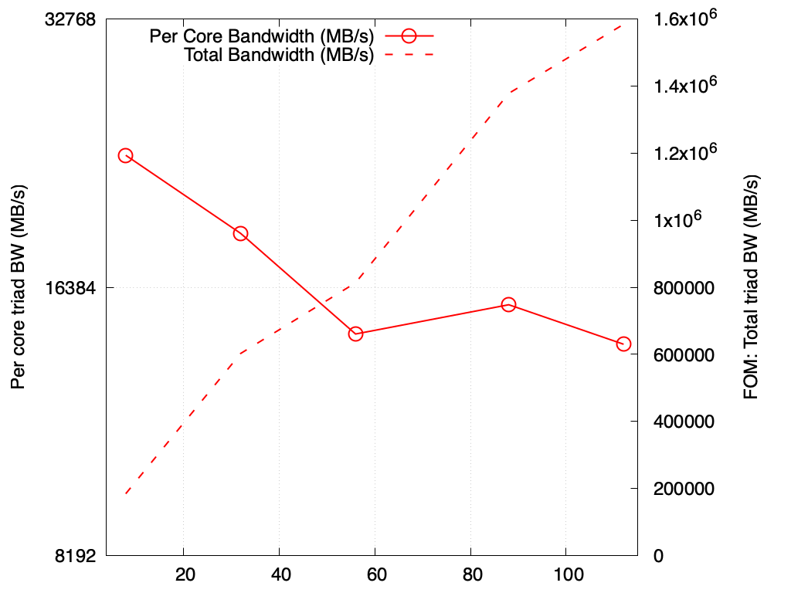

******
STREAM
******

Purpose
=======

The `STREAM <https://github.com/jeffhammond/STREAM>`_ benchmark is a widely used benchmark for measuring memory bandwidth. It measures the sustainable memory bandwidth of a computer system by performing simple read and write operations on large arrays.

Characteristics
===============

STREAM is available:
- Github: `STREAM_github <https://github.com/jeffhammond/STREAM>`_ 
- Official site: `STREAM_official <https://www.cs.virginia.edu/stream/>`_
- LANL Crossroads site: `STREAM_LANL <https://www.lanl.gov/projects/crossroads/_assets/docs/micro/stream-bench-crossroads-v1.0.0.tgz>`_

Problem
-------

There are four memory operations that the STREAM benchmark measures: Copy, Scale, Add, and Triad.

Copy - Copies data from one array to another:

.. math:: 

b[i] = a[i]

Scale - Multiplies each array element by a constant, a daxpy operation.

.. math::

b[i] = q*a[i]

Add - Adds two arrays element-wise:

.. math::

c[i] = a[i] + b[i]

Triad - Multiply-add operation:

.. math::

a[i] = b[i] + q*c[i]

These operations stress memory and floating point pipelines.They test memory transfer speed, computation speed, and different combinations of these two components of overall performance performance.

Figure of Merit
---------------

The primary FOM is the MAX Triad rate (MB/s).

Run Rules
---------

The program must synchronize between each operation. For instance:

On a heterogeneous system, run stream for all computational devices. Where there is unified or heterogeneously addressable memory, also provide performance numbers for each device's access to available memory types.

For instance:
On a heterogenous node architecture with multi-core CPU with HBM2 memory and a GPU with HBM3 memory Stream performance should be reported for: CPU <-> HBM2, GPU <-> HBM3, CPU <-> HBM3, GPU <-> HBM2

Present n CPU we want to see the scale as function of cores. On GPU maximum bandwidth.

Building
========

Adjustments to GOMP_CPU_AFFINITY may be necessary.

The STREAM_ARRAY_SIZE value is a critical parameter set at compile time and controls the size of the array used to measure bandwidth. STREAM requires different amounts of memory to run on different systems, depending on both the system cache size(s) and the granularity of the system timer.

You should adjust the value of 'STREAM_ARRAY_SIZE' (below) to meet BOTH of the following criteria:

1) Each array must be at least 4 times the size of the available cache memory. I don't worry about the difference between 10^6 and 2^20, so in practice the minimum array size is about 3.8 times the cache size.
    (a) Example 1: One Xeon E3 with 8 MB L3 cache STREAM_ARRAY_SIZE should be >= 4 million, giving an array size of 30.5 MB and a total memory requirement of 91.5 MB.
    (b) Example 2: Two Xeon E5's with 20 MB L3 cache each (using OpenMP) STREAM_ARRAY_SIZE should be >= 20 million, giving an array size of 153 MB and a total memory requirement of 458 MB.
2) The size should be large enough so that the 'timing calibration' output by the program is at least 20 clock-ticks. For example, most versions of Windows have a 10 millisecond timer granularity.  20 "ticks" at 10 ms/tic is 200 milliseconds. If the chip is capable of 10 GB/s, it moves 2 GB in 200 msec. This means the each array must be at least 1 GB, or 128M elements.

Set STREAM_ARRAY_SIZE using the -D flag on your compile line.

Example calculations for results presented here:

STREAM ARRAY SIZE CALCULATIONS:

::

 ARRAY_SIZE ~= 4 x (45 MiB cache / processor) x (2 processors) / (3 arrays) / (8 bytes / element) = 15 Mi elements = 15000000

::

  HASWELL: Intel(R) Xeon(R) CPU E5-2698 v3 @ 2.30GHz
    CACHE: 40M
    SOCKETS: 2
    4 * ( 40M * 2 ) / 3 ARRAYS / 8 Bytes/element =  13.4 Mi elements = 13400000 

::

  BROADWELL: Intel(R) Xeon(R) CPU E5-2695 v4 @ 2.10GHz
    CACHE: 45M
    SOCKETS: 2
    4 * ( 45M * 2 ) / 3 ARRAYS / 8 BYTES/ELEMENT = 15.0 Mi elements = 15000000

::

  SAPPHIRE RAPIDS: Intel(R) Xeon(R) Platinum 8480+
    CACHE: 105
    SOCKETS: 2
    4 x (105M * 2 ) / 3 ARRAYS / 8 BYTES/ELEMENT = 35 Mi elements = 35000000

Running
=======

.. code-block:: bash

  srun -n <num_processes> ./stream

Replace `<num_processes>` with the number of MPI processes you want to use. For example, if you want to use 4 MPI processes, the command will be:

.. code-block:: bash

  srun -n 4 ./stream

Example Results
===============
Results from Branson are provided on the following systems:

* Crossroads (see :ref:`GlobalSystemATS3`)

Crossroads
----------

.. csv-table:: STREAM microbenchmark bandwidth measurement
   :file: stream-xrds_ats5cce-cray-mpich.csv
   :align: center
   :widths: 10, 10, 10
   :header-rows: 1

