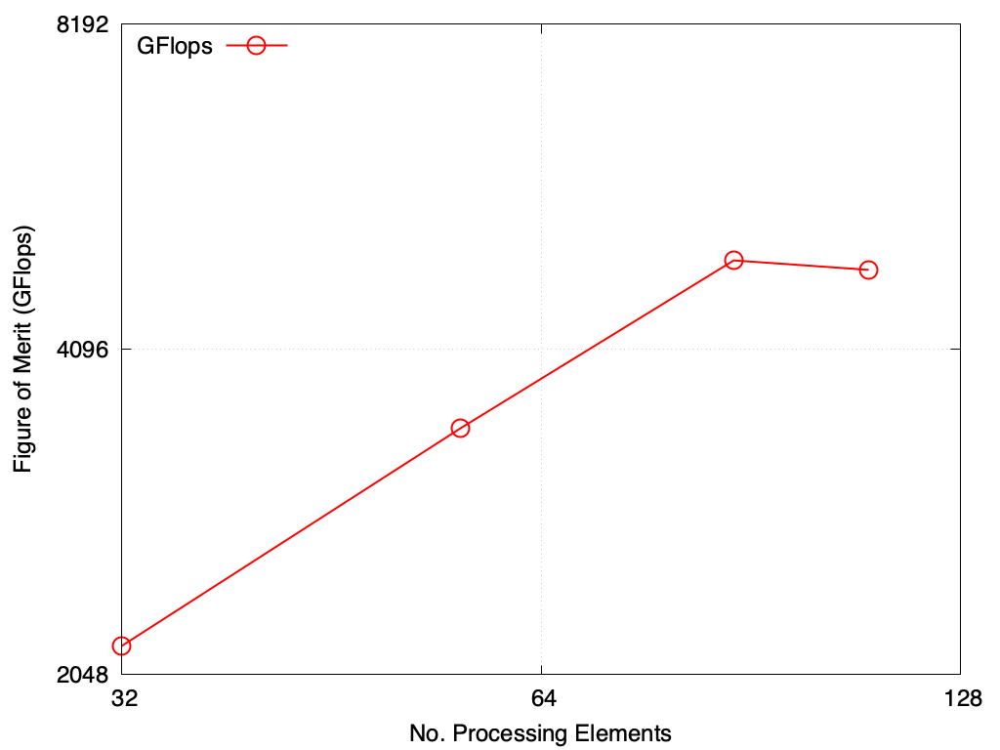

*****
DGEMM
*****

Purpose
=======

The DGEMM benchmark measures the sustained floating-point rate of a single node.

Characteristics
===============

- LANL Crossroads Site: `DGEMM <https://www.lanl.gov/projects/crossroads/_assets/docs/micro/mtdgemm-crossroads-v1.0.0.tgz>`_

Problem
-------

.. math::

    \mathbf{C} = \alpha*\mathbf{A}*\mathbf{B} + \beta*\mathbf{C}

Where :math:`A B C` are square :math:`NxN` vectors and :math:`\alpha` and :math:`\beta` are scalars. This operation is repeated :math:`R` times.

Figure of Merit
---------------

The Gigaflops per second rate reported at the end of the run

::

    GFLOP/s rate:         <FOM> GF/s

Run Rules
---------

* Vendors are permitted to change the source code in the region marked in the source.
* Optimized BLAS/DGEMM routines are permitted (and encouraged) to demonstrate the highest performance.
* Vendors may modify the Makefile(s) as required

Building
========

Load the compiler; make and enter a build directory.

.. code-block:: bash

    cmake -DBLAS_NAME=<blas library name> ..
    make

..

Current `BLAS_NAME` options are mkl, cblas (openblas), essl, or the raw coded (OpenMP threaded) dgemm.
The `BLAS_NAME` argument is required.
If the headers or libraries aren't found provide `BLAS_LIB_DIR`, `BLAS_INCLUDE_DIR`, or `BLAS_ROOT` to cmake.
If using a different blas library, modify the C source file to use the correct header and dgemm command.

Running
=======

DGEMM uses OpenMP but does not use MPI.

Set the number of OpenMP threads and other OMP characteristics with export.
The following were used for the Crossroads (:ref:`GlobalSystemATS3`) system.

.. code-block:: bash

    export OPENBLAS_NUM_THREADS=<nthreads> #MKL INHERITS FROM OMP_NUM_THREADS.
    export OMP_NUM_THREADS=<nthreads>
    export OMP_PLACES=cores
    export OMP_PROC_BIND=close

..

.. code-block:: bash

    ./mt-dgemm <N> <R> <alpha> <beta>

..

These values default to: :math:`N=256, R=8, \alpha=1.0, \beta=1.0`

These inputs are subject to the conditions :math:`N>128, R>4`.

These are positional arguments, so, for instance, R cannot be set without setting N.

Example Results
===============

Results from DGEMM are provided on the following systems:

* Crossroads (see :ref:`GlobalSystemATS3`)

Crossroads
----------

This test was built with the intel 2023.1.0 compiler using the crayOS compiler wrapper where: :math:`N=2500, R=500, \alpha=1.0, \beta=1.0`. The 110 core run (cores are used as OpenMP threads) avoids the OS dedicated cores and takes roughly an hour. All four runs on rocinante hbm take 5-6 hours.

.. csv-table:: DGEMM microbenchmark FLOPs measurement
   :file: dgemm_ats3.csv
   :align: center
   :widths: 10, 10
   :header-rows: 1

