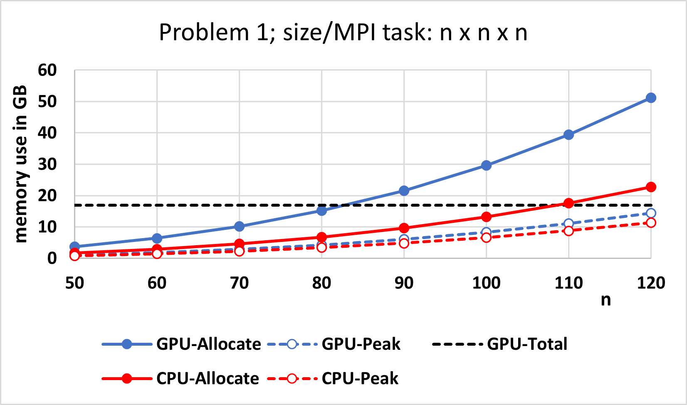
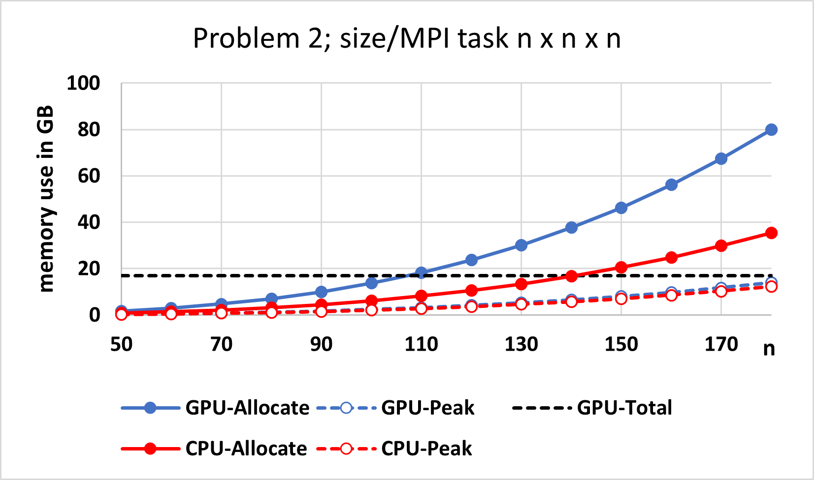

******
AMG2023
******

This is the documentation for Benchmark - parallel algebraic multigrid solver for 3D diffusion problems. 

Purpose
=======

The AMG2023 benchmark consists of a driver (amg.c), a simple Makefile, and documentation. It is available at https://github.com/LLNL/AMG2023 . 
It requires an installation of hypre 2.27.0. 
It uses hypre's parallel algebraic multigrid (AMG) solver BoomerAMG in combination with a Krylov solver to solve 
two linear systems arising from diffusion problems on a cuboid discretized by finite differences. 
The problems are set up through hypre's linear-algebraic IJ interface. The problem sizes can be controlled from the command line.`. 

Characteristics
===============

Problems
-------

* Problem 1 (default): The default problem is a 3D diffusion problem on a cuboid with a 27-point stencil.  It is solved with AMG-GMRES(100). 

* Problem 2 (-problem 2): This problem solves a 3D Laplace problem on a cuboid with a 7-point stencil.  It is solved with AMG-PCG using one level of aggressive coarsening. 

The problem sizes for both problems can be set by the user from the command line.

Figure of Merit
---------------

The figures of merit (FOM_1 and FOM_2) are computed using 
the total number of nonzeros for all system matrices and interpolation operators on all levels of AMG, 
the wall clock time of AMG setup (for FOM_1), the wall clock time of the AMG solve phase and the number of iterations (for FOM_2). 

Currently, FOM is evaluated as follows:

FOM = (FOM_1 + FOM_2)/2

Final FOM still TBD.

Building
========

The AMG2023 benchmark uses a simple Makefile system for building the driver.

It requires an installation of hypre 2.27.0, which can be downloaded from https://github.com/hypre-space/hypre via

   ``git clone -b v2.27.0 https://github.com/hypre-space/hypre.git``

Information on how to install hypre is available here: https://hypre.readthedocs.io/en/latest/ 

Depending on the machine and desired programming models, different configurations are needed.
hypre configure options can be obtained by typing

   ``./configure --help``

in hypre's src directory.

When using CPUs only, hypre generally can be installed by typing

   ``./configure``
   ``make install``

in the src directory.

If OpenMP threading within MPI tasks is desired, it should be configured as follows:

   ``./configure --with-openmp --enable-hopscotch``

If hypre should be run on Nvidia GPUs:

   ``./configure --with-cuda`` 

or 

   ``./configure --with-cuda --with-device-memory-pool``

to use the memory pool option included with hypre.

If hypre is to be run on AMD GPUs:

.. code-block:: bash

   ./configure --with-hip --with-gpu-arch=gfx90a 
   --with-MPI-lib-dirs="${MPICH_DIR}/lib" --with-MPI-libs="mpi" 
   --with-MPI-include="${MPICH_DIR}/include" 
..

If the problem to be run is larger than 2 billion, i.e., Px*Py*Pz*nx*ny*nz is larger than 2 billion, 
where Px*Py*Pz is the total number of MPI tasks and nx*ny*nz the local problem sizeper MPI task, hypre needs to be configured with 

   ``--enable-mixed-int``

since it requires 64-bit integers for some global variables. By default, hypre uses 32-bit integers.

To build the code, first modify the 'Makefile' file appropriately, 

then type

  ``make``

Other available targets are

.. code-block:: bash

  make clean       (deletes .o files)
  make distclean   (deletes .o files, libraries, and executables)
..

Running
=======

The driver for AMG2023 is called 'amg'. Type

   ``mpirun -np 1 amg -help``

to get usage information.  This prints out the following:

Usage: 

.. code-block:: bash

 amg [<options>]
 
  -P <Px> <Py> <Pz>  : define MPI process topology 

  -n <nx> <ny> <nz>  : define size per MPI process for problems on cube

  -problem 
       : 
 needs to be 1 (default) or 2

  -printstats        : print out detailed info on AMG setup and number of iterations
 
  -printallstats     : print out detailed info on AMG setup and solve
 
  -printsystem       : print out the system
..

All arguments are optional.  A very important option for AMG2023 is the '-P' option. 
It specifies the MPI process topology on which to run, requiring a total of  <Px>*<Py>*<Pz> MPI processes.  

The '-n' option allows one to specify the local problem size per MPI process, leading to a global problem size of <Px>*<nx> x <Py>*<ny> x <Pz>*<nz>.

Example Scalability Results 
===========================

Previous versions of AMG2023 have been run on the following platforms:

*  BG/Q  - up to over 1,000,000 MPI processes
*  BG/P  - up to 125,000 MPI processes
*  and more

Consider increasing both problem size and number of processors in tandem. On scalable architectures, time-to-solution for AMG2023 will initially increase, then it will level off at a modest numbers of processors, remaining roughly constant for larger numbers of processors.  Iteration counts will also increase slightly for small to modest sized problems, then level off at a roughly constant number for larger problem sizes.

For example, we get the following timing results (in seconds) for a system with a 3D 27-point stencil, distributed on a logical P x Q x R processor  topology, with fixed local problem size per process given as 96 x 96 x 96:

.. table:: Weak scaling on BG/Q
   :align: center

   +------------+--------+------------+------------+
   | P x Q x R  |  procs | setup time | solve time |
   +------------+--------+------------+------------+
   |  8x 8x 8   |    512 |     14.91  |   51.05    |
   +------------+--------+------------+------------+
   | 16x16x 8   |   2048 |     15.31  |   53.35    |
   +------------+--------+------------+------------+
   | 32x16x16   |   8192 |     16.00  |   57.78    |
   +------------+--------+------------+------------+
   | 32x32x32   |  32768 |     17.55  |   65.19    |
   +------------+--------+------------+------------+
   | 64x32x32   |  65536 |     17.49  |   64.93    |
   +------------+--------+------------+------------+

These results were obtained on BG/Q using MPI and OpenMP with 4 OpenMP threads per MPI task and configuring hypre with --enable-hopscotch --enable-persistent and --enable-bigint.

To measure strong scalability, it is important to change the size per process with the process topology:

The following results were achieved on RZTopaz for a 3D 7-pt Laplace problem on a 300 x 300 x 300 grid.

``srun -n <P*Q*R> amg -P 
 <Q> <R> -n <nx> <ny> <nz> -problem 2``

.. table:: Strong scaling on RZTopax: MPI only
   :align: center

   +------------+---------------+------------+------------+
   | P x Q x R  |  nx x ny x nz | setup time | solve time |
   +------------+---------------+------------+------------+
   | 1 x 1 x 1  |  300x300x300  |   43.37    |    61.85   |
   +------------+---------------+------------+------------+
   | 2 x 1 x 1  |  150x300x300  |   31.06    |    42.09   |
   +------------+---------------+------------+------------+
   | 2 x 2 x 1  |  150x150x300  |   15.68    |    22.74   |
   +------------+---------------+------------+------------+
   | 2 x 2 x 2  |  150x150x150  |    8.44    |    12.59   |
   +------------+---------------+------------+------------+
   | 4 x 2 x 2  |   75x150x150  |    5.37    |     8.39   |
   +------------+---------------+------------+------------+
   | 4 x 4 x 2  |   75x 75x150  |    2.70    |     6.80   |
   +------------+---------------+------------+------------+

.. table:: Strong scaling on RZTopaz: MPI with 4 OpenMP threads per MPI task
   :align: center

   +------------+---------------+------------+------------+
   | P x Q x R  |  nx x ny x nz | setup time | solve time |
   +------------+---------------+------------+------------+
   | 1 x 1 x 1  |  300x300x300  |   17.56    |    20.81   |
   +------------+---------------+------------+------------+
   | 2 x 1 x 1  |  150x300x300  |   12.04    |    14.48   |
   +------------+---------------+------------+------------+
   | 2 x 2 x 1  |  150x150x300  |    6.35    |     8.78   |
   +------------+---------------+------------+------------+
   | 2 x 2 x 2  |  150x150x150  |    3.14    |     6.84   |
   +------------+---------------+------------+------------+
   | 4 x 2 x 2  |   75x150x150  |    2.44    |     6.73   |
   +------------+---------------+------------+------------+

Memory Usage
============

AMG2023's memory needs are somewhat complicated to describe.  They are very dependent on the type of problem solved and the options used.  When turning on the '-printstats' option, memory complexities <mc> are displayed, which are defined by the sum of non-zeroes of all matrices (both system matrices and interpolation matrices on all levels) divided by the number of non-zeroes of the original matrix, i.e., at least about <mc> times as much space is needed.  However, this does not include memory needed for communication, vectors, auxiliary computations, etc. 

Figures J1 and J2 provide information about memory usage for Problems 1 and 2 on 1 GPU node of Lassen (equivalent to Sierra) using 4 MPI tasks and 1 node of Quartz using 4 MPI tasks with 9 OpenMP threads each for Problem 1 (Figure J1) and Problem 2 (Figure J2) for increasing problem size of n x n x n per MPI task. Both Memory Peak, i.e., the largest amount of memory used in the run as well as the accumulated memory usage are listed. The black dashed line indicates the GPU memory available on 1 node of Lassen.
Note that the memory usage listed is per MPI task only, i.e., for one GPU for the GPU runs, and for 1 MPI task with 9 OpenMP threads for the CPU runs. 

Verification of Results
=======================

References
==========

All references are available at https://github.com/hypre-space/hypre/wiki/Publications :

Van Emden Henson and Ulrike Meier Yang, "BoomerAMG: A Parallel Algebraic Multigrid Solver and Preconditioner", Appl. Num. Math. 41 (2002), pp. 155-177. 

Hans De Sterck, Ulrike Meier Yang and Jeffrey Heys, "Reducing Complexity in Parallel Algebraic Multigrid Preconditioners", SIAM Journal on Matrix Analysis and Applications 27 (2006), pp. 1019-1039. 

Hans De Sterck, Robert D. Falgout, Josh W. Nolting and Ulrike Meier Yang, "Distance-Two Interpolation for Parallel Algebraic Multigrid", Numerical Linear Algebra with Applications 15 (2008), pp. 115-139. 

Ulrike Meier Yang, "On Long Range Interpolation Operators for Aggressive Coarsening", Numer. Linear Algebra Appl.,  17 (2010), pp. 453-472. 

Allison Baker, Rob Falgout, Tzanio Kolev, and Ulrike Yang, "Multigrid Smoothers for Ultraparallel Computing", SIAM J. Sci. Comput., 33 (2011), pp. 2864-2887. 

Rui Peng Li, Bjorn Sjogreen, Ulrike Yang, "A New Class of AMG Interpolation Methods Based on Matrix-Matrix Multiplications", SIAM Journal on Scientific Computing, 43 (2021), pp. S540-S564, https://doi.org/10.1137/20M134931X 

Rob Falgout, Rui Peng Li, Bjorn Sjogreen, Lu Wang, Ulrike Yang, "Porting hypre to Heterogeneous Computer Architectures: Strategies and Experiences", Parallel Computing, 108, (2021), a. 102840

