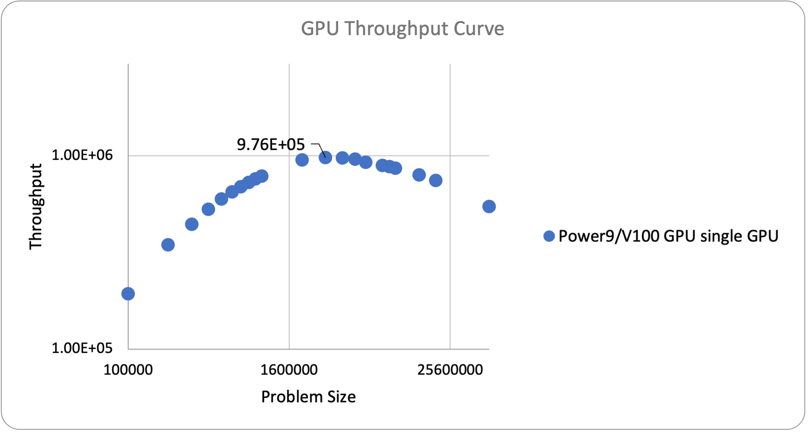

******
Parthenon-VIBE
******

This is the documentation for the ATS-5 Benchmark, Parthenon-VIBE. 
Purpose
=======

From their [site]_:

A benchmark that solves the Vector Inviscid Burgers' Equation on a block-AMR mesh.

===============

Problem
-------
The benchmark performance problem solves

.. math::
   \partial_t \mathbf{u} + \nabla\cdot\left(\frac{1}{2}\mathbf{u} \mathbf{u}\right) = 0

and evolves one or more passive scalar quantities :math:`q^i` according to

.. math:: 
   \partial_t q^i + \nabla \cdot \left( q^i \mathbf{u} \right) = 0

as well as computing an auxiliary quantity :math:`d`` that resemebles a kinetic energy

.. math:: 
   d = \frac{1}{2} q^0 \mathbf{u}\cdot\mathbf{u}.

Parthenon-VIBE makes use of a Godunov-type finite volume scheme with options for slope-limited linear or WENO5 reconstruction, HLL fluxes, and second order Runge-Kutta time integration.
Characteristics

Figure of Merit
---------------

The Figure of Merit is defined as cell zone-cycles / wallsecond which is the number of AMR zones processed per second of execution time. 

Building
========

Accessing the sources

* Clone the submodule from the benchmarks repository checkout 

.. code-block:: bash

   cd <path to benchmarks>
   git submodule update --init --recursive
   cd parthenon
 
..

Build requirements:

* CMake 3.16 or greater
* C++17 compatible compiler
* Kokkos 3.6 or greater
* MPI 

To build Parthenon on CPU, including this benchmark, with minimal external dependencies, start here:

.. code-block:: bash

   parthenon$ mkdir build && cd build
   build$ export CXXFLAGS="-mavx2 -fno-math-errno -march=broadwell"
   build$ cmake -DPARTHENON_DISABLE_HDF5=ON -DPARTHENON_DISABLE_OPENMP=ON -DPARTHENON_ENABLE_PYTHON_MODULE_CHECK=OFF -DREGRESSION_GOLD_STANDARD_SYNC=OFF ../
   build$ make -j

.. 

On a CTS-1 machine the relevant modules are:

.. code-block:: bash
   
   intel-classic/2021.2.0 intel-mpi/2019.9.304 cmake/3.22.3

To build for execution on a single GPU, it should be sufficient to add the following flags to the CMake configuration line

.. code-block:: bash
   
   cmake -DPARTHENON_DISABLE_MPI=ON -DKokkos_ENABLE_CUDA=ON -DKokkos_ARCH_AMPERE80=ON

..

where `Kokkos_ARCH` should be set appropriately for the machine (see [here](https://kokkos.github.io/kokkos-core-wiki/keywords.html)).

Running
=======

The benchmark includes an input file ``_burgers.pin_`` that specifies the base (coarsest level) mesh size, the size of a mesh block, the number of levels, and a variety of other parameters that control the behavior of Parthenon and the benchmark problem configuration.

The executable `burgers-benchmark` will be built in `parthenon/build/benchmarks/burgers/` and can be run as, e.g.

.. code-block:: bash

   mpirun -n 36 burgers-benchmark -i ../../../benchmarks/burgers/burgers.pin parthenon/mesh/nx1=128 parthenon/mesh/nx2=128 parthenon/mesh/nx3=128 parthenon/meshblock/nx1=32 parthenon/meshblock/nx2=32 parthenon/meshblock/nx3=32 parthenon/nlim=250

..

The mesh size parameters are chosen to mimic a relatively realistic use case: a :math:`128^3` base mesh with 2 levels of refinement and :math:`32^3` mesh regions (called mesh blocks). This setup has a high water mark of about 40GB of memory, which is roughly 30% of the memory available on a CTS-1 machine. Memory was measured using the tool ``parse_spatter_top.py`` found in this repository. It was independently verified with the [Kokkos Tools Memory High Water Mark](https://github.com/kokkos/kokkos-tools/wiki/MemoryHighWater) tool.

Example FOM Results 
===================

.. table:: CTS-1 problem size of 10 million particles
   :align: center

   +--------+----------+---------------------+
   | |cores | |runtime | | throughput        |
   | |      | |        | | (particles/second)|
   +========+==========+=====================+
   |1       | 1201.9   |      8.32E+03       |
   +--------+----------+---------------------+
   |2       | 616.6    |      1.62E+04       |
   +--------+----------+---------------------+
   |4       | 317.7    |      3.15E+04       |
   +--------+----------+---------------------+
   |8       | 174.3    |      5.74E+04       |
   +--------+----------+---------------------+
   |16      | 96.6     |      1.04E+05       |
   +--------+----------+---------------------+
   |32      | 49.1     |      2.04E+05       |
   +--------+----------+---------------------+
   |36      | 43.6     |      2.29E+05       |
   +--------+----------+---------------------+

   CPU Strong Scaling (Fixed problem size, 10M Particles)

.. table:: Power9/V100 single GPU throughput as a function of problem size
   :align: center

   +-----------+-------------+------------+
   | particles | runtime     | throughput |
   +===========+=============+============+
   | 100000    | 0.519094667 | 1.93E+05   |
   +-----------+-------------+------------+
   | 200000    | 0.579010333 | 3.45E+05   |
   +-----------+-------------+------------+
   | 300000    | 0.678844333 | 4.42E+05   |
   +-----------+-------------+------------+
   | 400000    | 0.759374333 | 5.27E+05   |
   +-----------+-------------+------------+
   | 500000    | 0.837198333 | 5.97E+05   |
   +-----------+-------------+------------+
   | 600000    | 0.925370667 | 6.48E+05   |
   +-----------+-------------+------------+
   | 700000    | 1.013963333 | 6.90E+05   |
   +-----------+-------------+------------+
   | 800000    | 1.102606667 | 7.26E+05   |
   +-----------+-------------+------------+
   | 900000    | 1.18851     | 7.57E+05   |
   +-----------+-------------+------------+
   | 1000000   | 1.276283333 | 7.84E+05   |
   +-----------+-------------+------------+
   | 2000000   | 2.105656667 | 9.50E+05   |
   +-----------+-------------+------------+
   | 3000000   | 3.07436     | 9.76E+05   |
   +-----------+-------------+------------+
   | 4000000   | 4.105593333 | 9.74E+05   |
   +-----------+-------------+------------+
   | 5000000   | 5.221723333 | 9.58E+05   |
   +-----------+-------------+------------+
   | 6000000   | 6.508423333 | 9.22E+05   |
   +-----------+-------------+------------+
   | 8000000   | 8.99235     | 8.90E+05   |
   +-----------+-------------+------------+
   | 9000000   | 10.2506     | 8.78E+05   |
   +-----------+-------------+------------+
   | 10000000  | 11.63873333 | 8.59E+05   |
   +-----------+-------------+------------+
   | 15000000  | 18.89953333 | 7.94E+05   |
   +-----------+-------------+------------+
   | 20000000  | 26.9172     | 7.43E+05   |
   +-----------+-------------+------------+
   | 50000000  | 91.69766667 | 5.45E+05   |
   +-----------+-------------+------------+

   GPU throughput as a function of problem size

Verification of Results
=======================

References
==========

.. [site]  'Parthenon', 2023. [Online]. Available: https://github.com/parthenon-hpc-lab/parthenon. [Accessed: 20- Mar- 2023]
