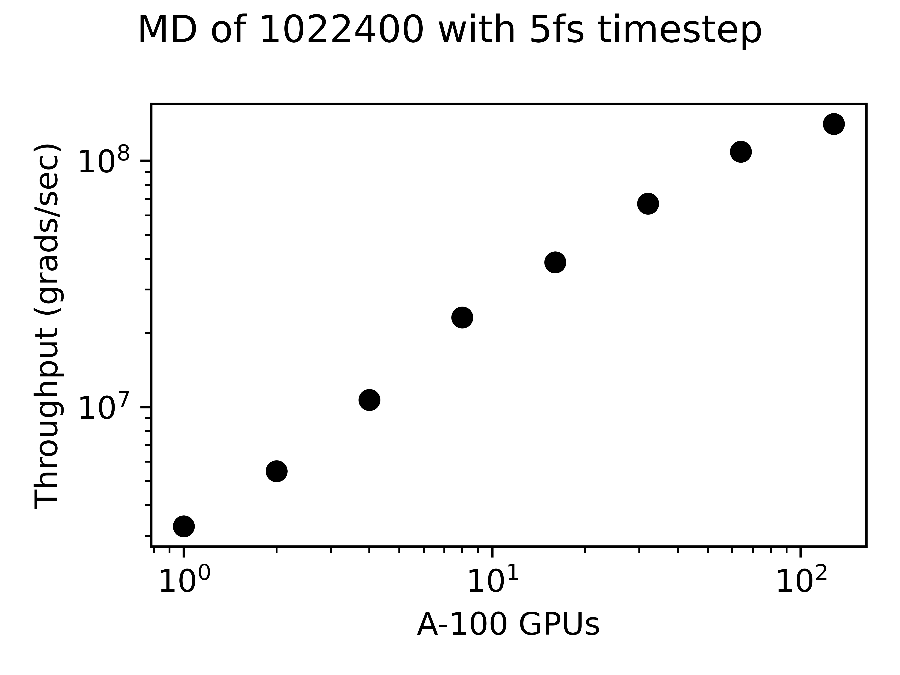

******
Lammps-kokkos-HIPPYNN
******

This is the documentation for the ATS-5 Benchmark for HIPPYNN driven kokkos-Lammps Molecular Dynamics. 

Purpose
=======

To benchmark perfromance of Lammps driven Molecular Dynamics. The problem configured in this test is a small Ag model built using the data included in the Alegro paper (DOI: )   

Characteristics
===============

Problem
-------
This is a set of simulations on 1,022,400 silver atoms at a 5fs time step. 

This benchmark is comparible to the Allegro Ag simulation: https://www.nature.com/articles/s41467-023-36329-y

This is a general purpose proxy for many MD simulations. 

This test will evaluate Pytorch performance, GPU performance, and MPI performance. 

Figure of Merit
---------------
The figure of merrit is the throughput of the MD simulations, whch is reported by lammps as 'Matom-step/s'. 

Building
========

Building the Lammps Python interface environment is somewhat challenging. Below is an outline of the process used to get the environment working on Chicoma

Building on Chicoma
-------------------

#Load modules:
module switch PrgEnv-cray PrgEnv-gnu
module load cuda/11.6
module load cpe-cuda
module load cray-libsci
module load cray-fftw
module load python/3.9-anaconda-2021.11
module load cmake
module load cudatoolkit/22.3_11.6

#Create virtual python environment
virtenvpath = <Set Path> 
conda create --prefix=${virtenvpath} python=3.10
source activate ${virtenvpath}
conda install pytorch-gpu cudatoolkit=11.6 cupy -c pytorch -c nvidia
conda install matplotlib h5py tqdm python-graphviz cython numba scipy ase -c conda-forge

#Install HIPPYNN
git clone git@github.com:lanl/hippynn.git
cd hippynn
git fetch origin lammps_kokkos_mliap
git checkout lammps_kokkos_mliap
pip install -e --no-deps ./

#Install Lammps: 
git clone git@github.com:bnebgen-LANL/lammps-kokkos-mliap.git
git checkout lammps-kokkos-mliap
mkdir build
cd build
export CMAKE_PREFIX_PATH="${FFTW_ROOT}" 

make -j 12
make install-python

Building on nv-devkit
-------------------------
#Building on nv-devkit builds the python environment through spack, since conda building is not available. 

gcc_ver=11.2.0
gcc_openblas=8.4.0
module load gcc/$gcc_ver
git clone https://github.com/spack/spack.git
source spack/share/spack/setup-env.sh

spack compiler find

module load gcc/$gcc_openblas

spack compiler find

module load gcc/$gcc_ver

spack install py-torch%gcc@$gcc_ver cuda=True cuda_arch=80 mkldnn=False ^py-numpy@1.22.4 ^openblas%gcc@$gcc_openblas
spack install py-cupy%gcc@$gcc_ver ^nccl cuda_arch=80 ^py-numpy@1.22.4
spack install py-numba%gcc@$gcc_ver ^py-numpy@1.22.4 ^openblas%gcc@$gcc_openblas
spack install py-scipy%gcc@$gcc_ver ^py-numpy@1.22.4 ^openblas%gcc@$gcc_openblas
spack install py-matplotlib%gcc@$gcc_ver  ^py-numpy@1.22.4 ^openblas%gcc@$gcc_openblas
spack install py-h5py%gcc@$gcc_ver ^py-numpy@1.22.4 ^openblas%gcc@$gcc_openblas

spack load py-torch py-cupy py-numba py-numpy py-scipy py-matplotlib py-h5py

#Install HIPPYNN
git clone git@github.com:lanl/hippynn.git
cd hippynn
git fetch origin lammps_kokkos_mliap
git checkout lammps_kokkos_mliap
pip install -e --no-deps ./

#Build Lammps instructions
git clone git@github.com:bnebgen-LANL/lammps-kokkos-mliap --branch v1.0.0
cd  lammps-kokkos-mliap
mkdir build
cd build
cmake ../cmake \
 -DCMAKE_BUILD_TYPE=RelWithDebInfo \
 -DCMAKE_VERBOSE_MAKEFILE=ON \
 -DLAMMPS_EXCEPTIONS=ON \
 -DBUILD_SHARED_LIBS=ON \
 -DBUILD_MPI=ON \
 -DKokkos_ARCH_AMPERE90=ON \
 -DKokkos_ENABLE_CUDA=ON \
 -DCMAKE_CXX_STANDARD=17 \
 -DPKG_KOKKOS=ON \
 -DPKG_MANYBODY=ON \
 -DPKG_MOLECULE=ON \
 -DPKG_KSPACE=ON \
 -DPKG_REPLICA=ON \
 -DPKG_ASPHERE=ON \
 -DPKG_RIGID=ON \
 -DPKG_MPIIO=ON \
 -DCMAKE_POSITION_INDEPENDENT_CODE=ON \
 -DPKG_ML-SNAP=on \
 -DPKG_ML-IAP=on \
 -DPKG_PYTHON=on \
 -DMLIAP_ENABLE_PYTHON=on
 
make -j 12
make install-python

Running
=======

In the benchmarks/kokkos_lammps_hippynn folder, the file RunLammps-2node.bash is configured to be submitted to a SLURM queue. To evaluate different numbers of GPUs, the Slurm configuration will need to be changed. The MD-HO.in file does not need to be adjusted based upon the number of GPUs used in the simulation. It wiil build the atomic configuration from ag_box.DATA, load the Ag potential from TEST_AG_MODEL.pt, equilibrate the system at 300K, then run 10000 steps of timed MD. It is the last MD simulation that should be examined for performance. 

Results from Chicoma
====================

.. table:: Lammps-kokkos-HIPPYNN MD with 1022400 Ag atoms
   :align: center

+---------------------+---------------------+
| GPUs                | throughput (grad/s) |
+=====================+=====================+
|   1                 | 3.2770e+06          |
+---------------------+---------------------+
|   2                 | 5.4930e+06          |
+---------------------+---------------------+
|   4                 | 1.0691e+07          |
+---------------------+---------------------+
|   8                 | 2.3110e+07          |
+---------------------+---------------------+
|  16                 | 3.8727e+07          |
+---------------------+---------------------+
|  32                 | 6.7029e+07          |
+---------------------+---------------------+
|  64                 | 1.0883e+08          |
+---------------------+---------------------+
| 128                 | 1.4102e+08          |
+---------------------+---------------------+

Calculation performed on Chicoma. 

Verification of Results
=======================

References
==========

.. [site] Nicolas Lubbers, "HIPPYNN" 2021. [Online]. Available: https://github.com/lanl/hippynn. [Accessed: 6- Mar- 2023]
.. [site] Axel Kohlmeyer et. Al, "Lammps". [Online]. Available: https://github.com/lammps/lammps. [Accessed: 6- Mar- 2023]
