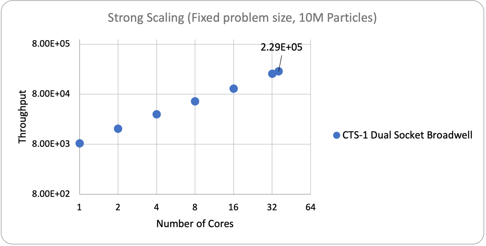
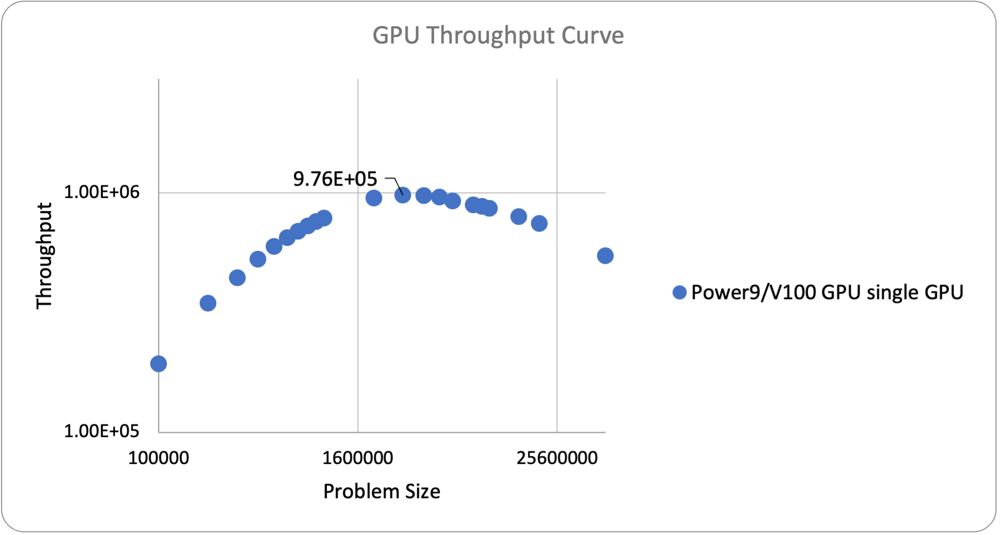

******
UMT
******

This is the documentation for the ATS-5 Benchmark UMT - 3D unstructured mesh single node. 

Purpose
=======

From their [site]_:

UMT (Unstructured Mesh Transport) is an LLNL ASC proxy application (mini-app) that solves a thermal radiative transport equation using discrete ordinates (Sn).  It utilizes an upstream corner balance method to compute the solution to the Boltzmann transport equation on unstructured spatial grids.

It is available at https://github.com/LLNL/UMT .

Characteristics
===============

Problem
-------
The benchmark performance problem <add test name here> is a single node problem on a 3D unstructured mesh.
TODO - either add more problem description here, or expand the 'test problem' section of UMT README.md and reference that.

Figure of Merit
---------------
The Figure of Merit is defined as the number of unknowns solved per second.

The number of unknowns solved by UMT is defined as:

.. code-block:: bash
   degrees of freedom =  <# mesh cells> * <# corners per cell> * <# total angles> * <number of energy groups>
..

The number of corners in a mesh cell is 8 for the 3D unstructured mesh problem.  For a 2D problem it would be 4.

Building
========

Accessing the source

* UMT can be found on github and cloned via:

.. code-block:: bash
   git clone https://github.com/LLNL/UMT.git
..

Build requirements:

* C/C++ compiler(s) with support for C++11 and Fortran compiler(s) with support for F2003.
* `CMake 3.18X <https://cmake.org/download/>`_

* MPI 3.0+

  * `OpenMPI 1.10+ <https://www.open-mpi.org/software/ompi/>`_
  * `mpich <http://www.mpich.org>`_
  * `mvapich2 https://mvapich.cse.ohio-state.edu>`_

  If OpenMP threading is used, the MPI implementation must support MPI_THREAD_MULTIPLE.

* TODO - add documentation on building the TPLS and UMT ( reference the existing docs in BUILDING.md in the UMT repo ).  Beef this up to make it easier.
* TODO - add example build instructions for typical linux distro for cpus, and also for a cpu+gpu machine.
* TODO - add documentation on avaiable cmake options, or else add this to BUILDING.md in UMT repo.

Generating the problem input
=======

* TODO docs on how to create mesh size appropriate for run.  Refer to python helper scripts, put some sample output.
* TODO - add the refinement args into 'makeUnstructured' executable so vendor can just make and refine the mesh in one step and skip calling 'test_driver' to refine it below.

For strong scaling on a CPU the memory footprint of UMT should be between 45%-55% of the computational device's main memory.  A python script /path/to/script/here is provided to assist in generating the correct command to generate a mesh to use a specified amount of memory.

Example of creating a mesh sized to use 128GB of memory ( 50% of a test node with 256GB ).  Will refine the mesh once, splitting each mesh cell edge into 27 edges and produce a mesh called 'refined_mesh.mesh'.
.. code-block:: bash
   makeUnstructuredBox 
   mpirun -n 1 test_driver -i unstructBox3D.mesh -c 0 -r 1 -R 27 -o .
..

Running
=======

* To run the included <problem name here> 3D test problem:

* TODO - the run line should have been produced by the python script, refer to that.
.. code-block:: bash
  mpirun -n 1 test_driver -c 1 -G128 -A3 -P3 -i ./refined_mesh.mesh
..

Example FOM Results 
===================

* Grabbed from Branson example, need to update with UMT numbers from whippet (1-112 cores)
.. table:: CTS-1 problem size of 10 million particles
   :align: center

   +--------+----------+---------------------+
   | |cores | |runtime | | throughput        |
   | |      | |        | | (#unknowns/second)|
   +========+==========+=====================+
   |1       | 1201.9   |      8.32E+03       |
   +--------+----------+---------------------+
   |2       | 616.6    |      1.62E+04       |
   +--------+----------+---------------------+
   |4       | 317.7    |      3.15E+04       |
   +--------+----------+---------------------+
   |8       | 174.3    |      5.74E+04       |
   +--------+----------+---------------------+
   |16      | 96.6     |      1.04E+05       |
   +--------+----------+---------------------+
   |32      | 49.1     |      2.04E+05       |
   +--------+----------+---------------------+
   |36      | 43.6     |      2.29E+05       |
   +--------+----------+---------------------+

   CPU Strong Scaling (Fixed problem size, <add here>M Unknowns)

* Need to produce this run ( use example from other code below for now )
.. table:: Power9/V100 single GPU throughput as a function of problem size
   :align: center

   +-----------+-------------+------------+
   | unknownss | runtime     | throughput |
   +===========+=============+============+
   | 100000    | 0.519094667 | 1.93E+05   |
   +-----------+-------------+------------+
   | 200000    | 0.579010333 | 3.45E+05   |
   +-----------+-------------+------------+
   | 300000    | 0.678844333 | 4.42E+05   |
   +-----------+-------------+------------+
   | 400000    | 0.759374333 | 5.27E+05   |
   +-----------+-------------+------------+
   | 500000    | 0.837198333 | 5.97E+05   |
   +-----------+-------------+------------+
   | 600000    | 0.925370667 | 6.48E+05   |
   +-----------+-------------+------------+
   | 700000    | 1.013963333 | 6.90E+05   |
   +-----------+-------------+------------+
   | 800000    | 1.102606667 | 7.26E+05   |
   +-----------+-------------+------------+
   | 900000    | 1.18851     | 7.57E+05   |
   +-----------+-------------+------------+
   | 1000000   | 1.276283333 | 7.84E+05   |
   +-----------+-------------+------------+
   | 2000000   | 2.105656667 | 9.50E+05   |
   +-----------+-------------+------------+
   | 3000000   | 3.07436     | 9.76E+05   |
   +-----------+-------------+------------+
   | 4000000   | 4.105593333 | 9.74E+05   |
   +-----------+-------------+------------+
   | 5000000   | 5.221723333 | 9.58E+05   |
   +-----------+-------------+------------+
   | 6000000   | 6.508423333 | 9.22E+05   |
   +-----------+-------------+------------+
   | 8000000   | 8.99235     | 8.90E+05   |
   +-----------+-------------+------------+
   | 9000000   | 10.2506     | 8.78E+05   |
   +-----------+-------------+------------+
   | 10000000  | 11.63873333 | 8.59E+05   |
   +-----------+-------------+------------+
   | 15000000  | 18.89953333 | 7.94E+05   |
   +-----------+-------------+------------+
   | 20000000  | 26.9172     | 7.43E+05   |
   +-----------+-------------+------------+
   | 50000000  | 91.69766667 | 5.45E+05   |
   +-----------+-------------+------------+

   GPU throughput as a function of problem size

Verification of Results
=======================

* TODO - add 

References
==========
