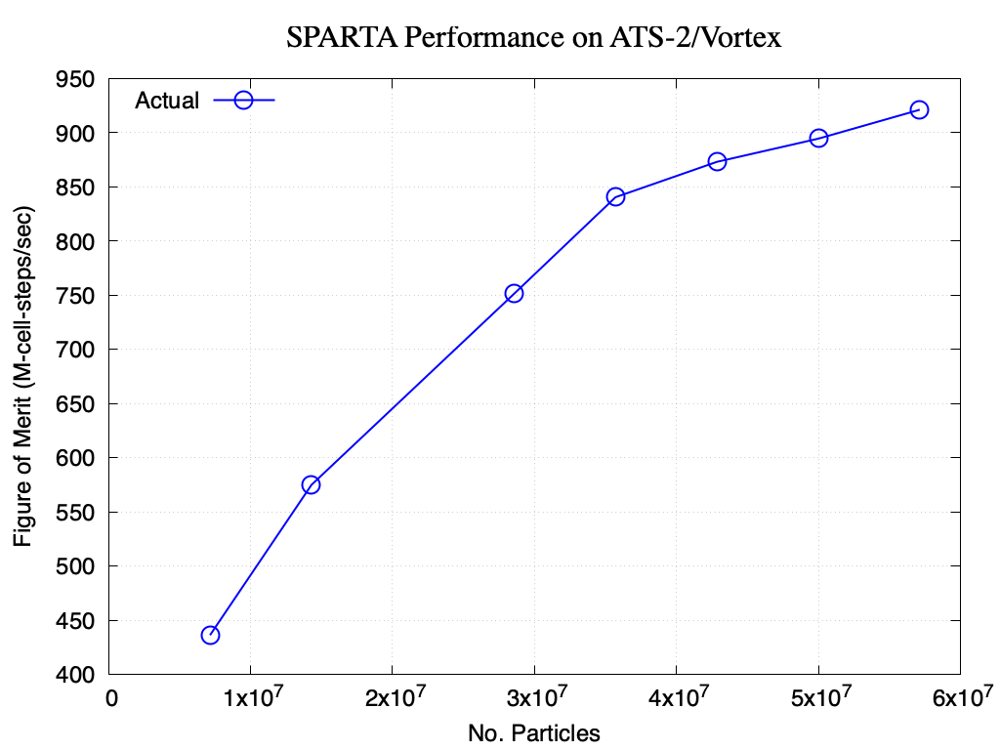

******
SPARTA
******

This is the documentation for the ATS-5 Benchmark [SPARTA]_. The content herein
was created by the following authors (in alphabetical order).

- `Anthony M. Agelastos <mailto:amagela@sandia.gov>`_
- `Michael A. Gallis <mailto:magalli@sandia.gov>`_
- `Stan Moore <mailto:stamoor@sandia.gov>`_
- `Douglas M. Pase <mailto:dmpase@sandia.gov>`_
- `Joel O. Stevenson <mailto:josteve@sandia.gov>`_

This material is based upon work supported by the Sandia National Laboratories
(SNL), a multimission laboratory managed and operated by National Technology and
Engineering Solutions of Sandia under the U.S. Department of Energy's National
Nuclear Security Administration under contract DE-NA0003525. Content herein
considered unclassified with unlimited distribution under SAND2023-01070O.

Purpose
=======

Heavily pulled from their [site]_:

   SPARTA is an acronym for **S**\ tochastic **PA**\ rallel **R**\ arefied-gas
   **T**\ ime-accurate **A**\ nalyzer. SPARTA is a parallel Direct Simulation
   Monte Carlo (DSMC) code for performing simulations of low-density gases in
   2d or 3d. Particles advect through a hierarchical Cartesian grid that
   overlays the simulation box. The grid is used to group particles by grid
   cell for purposes of performing collisions and chemistry. Physical objects
   with triangulated surfaces can be embedded in the grid, creating cut and
   split grid cells. The grid is also used to efficiently find particle/surface
   collisions. SPARTA runs on single processors or in parallel using
   message-passing techniques and a spatial-decomposition of the simulation
   domain. The code is designed to be easy to modify or extend with new
   functionality. Running SPARTA and the input command syntax is very similar
   to the LAMMPS molecular dynamics code (but SPARTA and LAMMPS use different
   underlying algorithms).

Characteristics
===============

Application Version
-------------------

The target application version corresponds to the Git SHA that the SPARTA git
submodule at the root of this repository is set to, i.e., within ``sparta``.

Problem
-------

This problem models 2D hypersonic flow of nitrogen over a circle with periodic
boundary conditions in the z dimension, which physically translates to 3D flow
over a cylinder of infinite length. Particles are continuously emitted from the
4 faces of the simulation box during the simulation, bounce off the circle, and
then exit. The hierarchical cartesian grid is statically adapted to 6 levels
around the circle. The memory array used to hold particles is reordered by grid
cell every 100 timesteps to improve data locality and cache access patterns.

This problem is present within the upstream SPARTA repository. The components of
this problem are listed below (paths given are within SPARTA repository). Each
of these files will need to be copied into a run directory for the simulation.

``examples/cylinder/in.cylinder``
   This is the primary input file that controls the simulation. Some parameters
   within this file may need to be changed depending upon what is being run
   (i.e., these parameters control how long this simulation runs for and how
   much memory it uses).

``examples/cylinder/circle_R0.5_P10000.surf``
   This is the mesh file and will remain unchanged.

``examples/cylinder/air.*``
   These three files (i.e., ``air.species``, ``air.tce``, and ``air.vss``)
   contain the composition and reactions inherent with the air. These files,
   like the mesh file, are not to be edited.

An excerpt from this input file that has its key parameters is
provided below.

.. code-block::
   :emphasize-lines: 5,11

   <snip>
    37 ###################################
    38 # Simulation initialization standards
    39 ###################################
    40 variable            ppc equal 34
   <snip>
   149 ###################################
   150 # Unsteady Output
   151 ###################################
   <snip>
   174 run                 1000

These parameters are described below.

``ppc``
   This sets the **p**\ articles **p**\ er **c**\ ell variable. This variable
   controls the size of the problem and, accordingly, the amount of memory it
   uses.

``run``
   This sets how many iterations it will run for, which also controls the wall
   time required for termination.

Figure of Merit
---------------

Each SPARTA simulation writes out a file named "log.sparta". At the end of this
simulation is a block that resembles the following example.

.. code-block::
   :emphasize-lines: 8-14

   Step CPU Np Natt Ncoll Maxlevel
          0            0   446441        0        0        5
         50   0.95011643   446367     3671     2981        5
        100    2.1636236   446384     5096     4079        5
        150     3.459164   446330     5588     4380        5
        200    4.7954215   446424     5895     4606        5
        250    6.1550201   446373     6104     4720        5
        300    7.5329763   446354     6083     4669        5
        350    8.9225474   446391     6178     4775        5
        400    10.324853   446388     6380     4915        5
        450    11.736653   446369     6349     4769        5
        500    13.157484   446307     6470     4903        5
        550    14.587244   446341     6363     4751        5
        600    16.023752   446378     6457     4845        5
        650    17.468165   446372     6475     4829        5
        700    18.918792   446382     6514     4789        5
        750    20.375701   446378     6623     4842        5
        800    21.840051   446423     6550     4798        5
        850    23.309482   446431     6615     4876        5
        900    24.784149   446377     6676     4950        5
        950    26.263906   446406     6746     4862        5
       1000    27.748297   446377     6542     4847        5
   Loop time of 27.7483 on 1 procs for 1000 steps with 446377 particles

The quantity of interest (QOI) is "mega particle steps per second," which can be
computed from the above table by multiplying the third column (no. of particles) by
the first (no. of steps), dividing the result by the second column (elapsed time
in seconds), and finally dividing by 1,000,000 (normalize).

The number of steps must be large enough so the times mentioned in the second
column exceed 600 (i.e., so it runs for at least 10 minutes). The figure of
merit (FOM) is the harmonic mean of the QOI computed from the times between 300
and 600 seconds.

A Python script (named ``sparta_fom.py``) is included within the repository to
aid in computing this quantity. Pass it the ``-h`` command line argument to
view its help page for additional information.

System Information
==================

The platforms utilized for benchmarking activities are listed and described below.

* Commodity Technology System 1 (CTS-1) with Intel Cascade Lake processors,
  known as Manzano at SNL (see :ref:`SystemCTS1`)
* Advanced Technology System 3 (ATS-3), also known as Crossroads (see
  :ref:`SystemATS3`)
* Advanced Technology System 2 (ATS-2), also known as Sierra (see
  :ref:`SystemATS2`)

.. _SystemCTS3:

CTS-1/Manzano
-------------

.. note::
   The CTS-1/Manzano system is used as a placeholder for when ATS-3/Crossroads
   is available.

The Manzano HPC cluster has 1,488 compute nodes connected together by a
high-bandwidth, low-latency Intel OmniPath network where each compute node uses
two Intel Xeon Platinum 8268 (Cascade Lake) processors. Each processor has 24
cores, and each node has 48 physical cores and 96 virtual cores. Each core has a
base frequency of 2.9 GHz and a max frequency of 3.9 GHz. Cores support two
AVX512 SIMD units each, with peak floating-point performance (RPEAK) of 2.9 GHz
x 32 FLOP/clock x 48 cores = 4.45 TF/s. Measured DGEMM performance is just under
3.5 TF/s per node (78.5% efficiency).

Compute nodes are a Non-Uniform Memory Access (NUMA) design, with each processor
representing a separate NUMA domain. Each processor (domain) supports six
channels of 2,933 MT/s DDR4 memory. Total memory capacity is 4 GB/core, or 192
GB/node. Memory bandwidth for the node is 12 channels x 8 bytes / channel x
2.933 GT/s = 281.568 GB/s, and measured STREAM TRIAD throughput for local memory
access is approximately 215 GB/s (76% efficiency). Cache design uses three
levels of cache, with L1 using separate instruction and data caches, L2 unifying
instruction and data, and L3 being shared across all cores in the processor. The
cache size is 1.5 MB/core, 35.75 MB/processor, or 71.5 MB/node.

.. _SystemATS3:

ATS-3/Crossroads
----------------

This system is not available yet but is slated to be the reference platform.

.. _SystemATS2:

ATS-2/Sierra
------------

This system has a plethora of compute nodes that are made up of Power9
processors with four NVIDIA V100 GPUs. Please refer to [Sierra-LLNL]_ for more
detailed information.

A Sierra application and regression testbed system named Vortex, housed at SNL,
was used for benchmarking for convenience. Vortex has the same compute node
hardware as Sierra.

Building
========

Instructions are provided on how to build SPARTA for the following systems:

* Generic (see :ref:`BuildGeneric`)
* Commodity Technology System 1 (CTS-1) with Intel Cascade Lake processors,
  known as Manzano at SNL (see :ref:`BuildCTS1`)
* Advanced Technology System 2 (ATS-2), also known as Sierra (see
  :ref:`BuildATS2`)

If submodules were cloned within this repository, then the source code to build
SPARTA is already present at the top level within the "sparta" folder.

.. _BuildGeneric:

Generic
-------

Refer to SPARTA's [build]_ documentation for generic instructions.

.. _BuildCTS1:

CTS-1/Manzano
-------------

.. note::
   The CTS-1/Manzano system is used as a placeholder for when ATS-3/Crossroads
   is available.

Instructions for building on Manzano are provided below. These instructions
assume this repository has been cloned and that the current working directory is
at the top level of this repository.

.. code-block:: bash

   cd doc/sphinx/8_sparta
   ./build-manzano.sh

.. _BuildATS2:

ATS-2/Vortex
------------

Instructions for building on Sierra are provided below.

.. code-block:: bash

   module load cuda/11.2.0
   module load gcc/8.3.1
   git clone https://github.com/sparta/sparta.git sparta
   pushd "sparta/src"
   make yes-kokkos
   make -j 64 vortex_kokkos
   ls -lh `pwd -P`/spa_vortex_kokkos
   popd

Running
=======

Instructions are provided on how to run SPARTA for the following systems:

* Commodity Technology System 1 (CTS-1) with Intel Cascade Lake processors,
  known as Manzano at SNL (see :ref:`RunCTS1`)
* Advanced Technology System 2 (ATS-2), also known as Sierra (see
  :ref:`RunATS2`)

.. _RunCTS1:

CTS-1/Manzano
-------------

.. note::
   The CTS-1/Manzano system is used as a placeholder for when ATS-3/Crossroads
   is available.

An example of how to run the test case on Manzano is provided below.

.. code-block:: bash

   module unload intel
   module unload openmpi-intel
   module use /apps/modules/modulefiles-apps/cde/v3/
   module load cde/v3/devpack/intel-ompi
   mpiexec \
       --np ${num_procs} \
       --bind-to socket \
       --map-by socket:span \
       "sparta/src/spa_manzano_kokkos" -in "in.cylinder" \
       >"sparta.out" 2>&1

.. _RunATS2:

ATS-2/Vortex
------------

An example of how to run the test case with a single GPU on Sierra is provided
below.

.. code-block:: bash

   module load gcc/8.3.1
   module load cuda/11.2.0
   jsrun \
       -M "-gpu -disable_gdr" \
       -n 1 -a 1 -c 1 -g 1 -d packed \
       "sparta/src/spa_vortex_kokkos" -in "in.cylinder" \
       -k on g 1 -sf kk -pk kokkos reduction atomic \
       >"sparta.out" 2>&1

Verification of Results
=======================

Results from SPARTA are provided on the following systems:

* Commodity Technology System 1 (CTS-1) with Intel Cascade Lake processors,
  known as Manzano at SNL (see :ref:`ResultsCTS1`)
* Advanced Technology System 2 (ATS-2), also known as Sierra (see
  :ref:`ResultsATS2`)

.. _ResultsCTS1:

CTS-1/Manzano
-------------

.. note::
   The CTS-1/Manzano system is used as a placeholder for when ATS-3/Crossroads
   is available.

Strong scaling performance (i.e., fixed problem size being run on different MPI
rank counts) plots of SPARTA on CTS-1/Manzano are provided within the following
subsections.

``ppc`` 11 (0.25 GiB/PE)
^^^^^^^^^^^^^^^^^^^^^^^^

.. csv-table:: SPARTA Strong Scaling Performance and Memory on Manzano with ppc=11 (0.25 GiB/PE)
   :file: cts1-0.25.csv
   :align: center
   :widths: 10, 10, 10, 10
   :header-rows: 1

.. figure:: cts1-0.25.png
   :align: center
   :scale: 50%
   :alt: SPARTA Strong Scaling Performance on Manzano with ppc=11 (0.25 GiB/PE)

   SPARTA Strong Scaling Performance on Manzano with ppc=11 (0.25 GiB/PE)

.. figure:: cts1mem-0.25.png
   :align: center
   :scale: 50%
   :alt: SPARTA Strong Scaling Memory on Manzano with ppc=11 (0.25 GiB/PE)

   SPARTA Strong Scaling Memory on Manzano with ppc=11 elements (0.25 GiB/PE)

``ppc`` 21 (0.50 GiB/PE)
^^^^^^^^^^^^^^^^^^^^^^^^

.. csv-table:: SPARTA Strong Scaling Performance and Memory on Manzano with ppc=21 (0.50 GiB/PE)
   :file: cts1-0.50.csv
   :align: center
   :widths: 10, 10, 10, 10
   :header-rows: 1

.. figure:: cts1-0.50.png
   :align: center
   :scale: 50%
   :alt: SPARTA Strong Scaling Performance on Manzano with ppc=21 (0.50 GiB/PE)

   SPARTA Strong Scaling Performance on Manzano with ppc=21 (0.50 GiB/PE)

.. figure:: cts1mem-0.50.png
   :align: center
   :scale: 50%
   :alt: SPARTA Strong Scaling Memory on Manzano with ppc=21 (0.50 GiB/PE)

   SPARTA Strong Scaling Memory on Manzano with ppc=21 elements (0.50 GiB/PE)

``ppc`` 42 (1.00 GiB/PE)
^^^^^^^^^^^^^^^^^^^^^^^^

.. csv-table:: SPARTA Strong Scaling Performance and Memory on Manzano with ppc=42 (1.00 GiB/PE)
   :file: cts1-1.00.csv
   :align: center
   :widths: 10, 10, 10, 10
   :header-rows: 1

.. figure:: cts1-1.00.png
   :align: center
   :scale: 50%
   :alt: SPARTA Strong Scaling Performance on Manzano with ppc=42 (1.00 GiB/PE)

   SPARTA Strong Scaling Performance on Manzano with ppc=42 (1.00 GiB/PE)

.. figure:: cts1mem-1.00.png
   :align: center
   :scale: 50%
   :alt: SPARTA Strong Scaling Memory on Manzano with ppc=42 (1.00 GiB/PE)

   SPARTA Strong Scaling Memory on Manzano with ppc=42 elements (1.00 GiB/PE)

``ppc`` 126 (2.00 GiB/PE)
^^^^^^^^^^^^^^^^^^^^^^^^

.. csv-table:: SPARTA Strong Scaling Performance and Memory on Manzano with ppc=126 (2.00 GiB/PE)
   :file: cts1-2.00.csv
   :align: center
   :widths: 10, 10, 10, 10
   :header-rows: 1

.. figure:: cts1-2.00.png
   :align: center
   :scale: 50%
   :alt: SPARTA Strong Scaling Performance on Manzano with ppc=126 (2.00 GiB/PE)

   SPARTA Strong Scaling Performance on Manzano with ppc=126 (2.00 GiB/PE)

.. figure:: cts1mem-2.00.png
   :align: center
   :scale: 50%
   :alt: SPARTA Strong Scaling Memory on Manzano with ppc=126 (2.00 GiB/PE)

   SPARTA Strong Scaling Memory on Manzano with ppc=126 elements (2.00 GiB/PE)

.. _ResultsATS2:

ATS-2/Vortex
------------

Throughput performance of SPARTA on ATS-2/Vortex is provided within the
following table and figure.

.. csv-table:: SPARTA Throughput Performance on ATS-2/Vortex
   :file: ats2.csv
   :align: center
   :widths: 10, 10
   :header-rows: 1

   SPARTA Throughput Performance on ATS-2/Vortex

References
==========

.. [SPARTA] S. J. Plimpton and S. G. Moore and A. Borner and A. K. Stagg
            and T. P. Koehler and J. R. Torczynski and M. A. Gallis, 'Direct
            Simulation Monte Carlo on petaflop supercomputers and beyond',
            2019, Physics of Fluids, 31, 086101.
.. [site] M. Gallis and S. Plimpton and S. Moore, 'SPARTA Direct Simulation
          Monte Carlo Simulator', 2023. [Online]. Available:
          https://sparta.github.io. [Accessed: 22- Feb- 2023]
.. [build] M. Gallis and S. Plimpton and S. Moore, 'SPARTA Documentation Getting
           Started', 2023. [Online]. Available:
           https://sparta.github.io/doc/Section_start.html#start_2. [Accessed:
           26- Mar- 2023]
