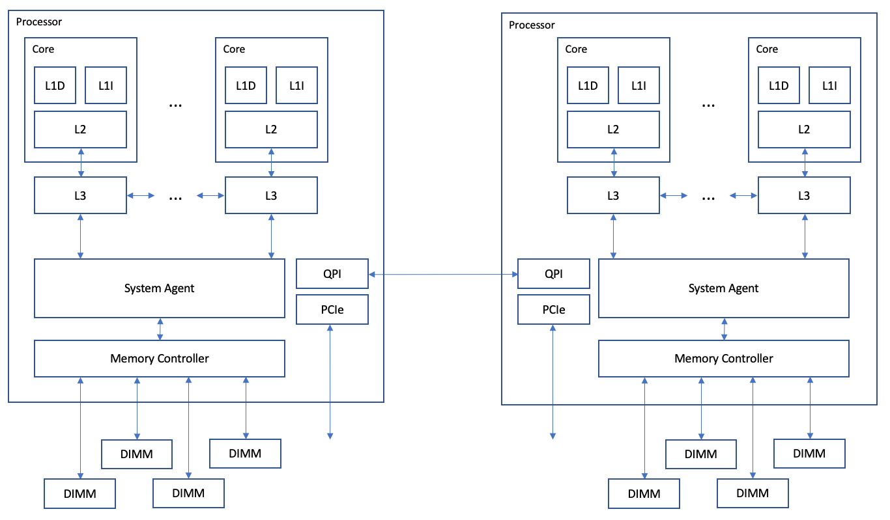

# Crossroads Acceptance

- PI: Douglas M. Pase [dmpase@sandia.gov](mailto:dmpase@sandia.gov)
- Erik A. Illescas [eailles@sandia.gov](mailto:eailles@sandia.gov)
- Anthony M. Agelastos [amagela@sandia.gov](mailto:amagela@sandia.gov)

This project tracks data and analysis from the Crossroads Acceptance effort.


## STREAM
STREAM, like DGEMM, is also a microbenchmark that measures a single fundamental
aspect of a system.
But while DGEMM measures floating-point vector performance, STREAM
measures memory bandwidth.
More specifically, it measures the performance of two 64-bit loads and a
store operation to a third location.
The operation looks like this:
```C
for (int i=0; i < size; i++) {
    x[i] = y[i] + constant * z[i];
}
```

Two 64-bit words are loaded into cache and registers, combined arithmetically,
and the result is stored in a third location.
In cache-based microprocessors, this typically means that all three
locations, ```x[i]```, ```y[i]```, and ```z[i]```, must be read into
cache.
Values ```x[i]``` and ```y[i]``` must be read because their values are needed
for the computation, but ```z[i]``` must also be loaded into cache in order to
maintain cache coherency.
With no other hardware support, this would mean the best throughput one could
hope for is about 75% of peak, because the processor must execute three loads
(one for each of ```x[i]```, ```y[i]```, and ```z[i]```) and one store (```z[i]```),
but it only gets credit for two loads (```x[i]``` and ```y[i]```) and one store (```z[i]```).
And, (2+1)/(3+1)=75%.

But most most current architectures support an optimization feature, called a
Microarchitectural Store Buffer (MSB), that speeds up the write operation in
some cases.
When a processor executes a cacheable write smaller than a cache line, the cache
controller first checks whether the cache line is already resident in cache.
When it is not, it caches the partial line in the MSB and sends the request on
to the memory controller to fetch the cache line.
If the rest of the cache line is overwritten before the data comes back from
the memory controller, the read request is cancelled and the new data is
moved from the MSB to the cache as a dirty (modified) cache line.
In this way the cache controller avoids the inefficiency of retrieving the
extra line from memory.

Another architectural feature that affects STREAM performance is
Non-Uniform Memory Access (NUMA).
This is best illustrated with a picture.
The following block diagram shows the processor, core, cache, and memory
structure of a typical Intel processor-based compute node.


***Processor, Core, Cache, and Memory Structure for Sandia Compute Nodes***

The illustration shows two processors, each with their own local memory (DIMMs).
High-speed communication links (QPI links) connect the two processors.
The two processors share a physical memory address space, so both processors
can access not only their own local memory, but also memory that is attached
to the other processor.
A program running on one of the cores in a processor requests to load or store
an address.
In the event the address misses cache, the request is forwarded to the System
Agent, which then sorts out whether the address is local or remote.
The System Agent then forwards the request to the appropriate memory controller
to be handled.
The important concept to understand is that access to memory that is local is
faster than access to memory that is remote.

The next concept to be concerned with is how memory is mapped to a program.
Programs do not reference physical memory directly.
Instead each program uses virtual addresses to reference data it uses, and
relies upon the hardware and operating system to translate those virtual
addresses into physical, or hardware, addresses.
Most modern NUMA-aware operating systems, Linux included, use a "first touch"
policy for deciding where memory is allocated.
When a program allocates memory it is only given new virtual addresses to use.
The physical memory backing the virtual address is allocated the first time
the memory is read or written.
Whenever possible, Linux allocates physical memory that is local to the
processor that is running the program at the moment the memory is first
referenced.
Linux then works very hard to keep the process running on the same core so
caches remain loaded and memory stays local.
For most programs this policy works very well, but for some threading
models, such as OpenMP, obtaining good performance in a NUMA environment
requires some care.

Because we are running an OpenMP-enabled version of STREAM, we must be
sure to schedule the parallel loops statically so the same iterations
go to the same threads (and therefore the same NUMA domains) every time.
This will ensure that memory references are always local, and therefore
of highest performance.

Note that the raw bandwidth of the node is determined by the number, width, 
and speed of the memory channels.
In the above illustration there are four channels per processor, but the
number will vary from one architecture to the next.
Each memory channel is the width of the data path of a DIMM, which is always
64-bits, or 8 bytes.
The frequency will vary with the DIMM, and it's measured in mega-transfers
per second, or MT/s.
(DIMMs use a differential clock, so the clock frequency of DDR memory is
always half of the transfer rate.)
Most systems at Sandia use memory speeds ranging from 2133 MT/s to 4800 MT/s.
A Haswell node, with four channels per processor, two processors per node,
and 2133 MT/s memory will have a hardware (or peak) bandwidth of:

```
4 channels/processor x 2 processors x 8 bytes/channel x 2133 MT/s = 136,512 MB/s
```

The peak bandwidth represents a least upper bound, a limit you are guaranteed
never to exceed.
The performance you measure is the throughput, and it will always be a value
below the peak bandwidth.
The ratio of the two values, throughput over bandwidth, is known as the
memory efficiency, and is a measure of how efficiently the memory transfers
data to and from the processor.
Modern processors typically have a memory efficiency of around 75% to 85%.
New memory architectures may have somewhat less, and rarely, an exceptionally
efficient system may have more than 90%.

Yet another consideration is how the instructions are generated by the compiler.
In this case there are two issues, using vector units and how addressing is
handled.
Vector instructions reduce the number of instructions that need to be executed,
which reduces memory traffic.
AVX instructions use wider vectors than SSE4.3 vectors, so AVX instructions 
provide better performance than using SSE4.3 instructions.
Similarly, AVX2 is faster than AVX, and AVX-512 is faster than AVX2.

Furthermore, how array indexes are generated and used can also have an impact
on STREAM performance.
For example, using statically allocated arrays allows the code generation to
use a constant array base address for references to ```x```, ```y```, and ```z```.
But using dynamically allocated arrays forces the program to load the base
addresses into registers and index the arrays indirectly.
On the Haswell architecture, at least, this impacts performance by roughly 25%.
Fortunately, on other architectures the impact is less severe, or not at all.

We also noticed on some systems a drop in STREAM performance with intel 18.0 
and later compilers.
We don't know with certainty what the cause is, but it is consistent, and we
suspect it might have had something to do with the way arrays are indexed.

The clock speed of the processor will also impact STREAM performance by a small
amount.
Faster processor clocks allow the processor to generate new memory requests 
more rapidly.
And because the compute nodes in each of the clusters are not perfectly 
identical, this means some nodes will have faster STREAM throughput than
others.

Our STREAM measurements are laid out in the following table.

| Cluster | Family          | Processor     | Ch./Node | DIMM MT/s | Bandwidth  | STREAM Static | Eff.  | STREAM Dynamic  |
| :-----: | :----:          | :-------:     | :------: | :-------: | --------:  | ----------: | ---:  | ------:  |
| Mutrino | Haswell         | <A HREF="https://ark.intel.com/content/www/us/en/ark/products/81060/intel-xeon-processor-e52698-v3-40m-cache-2-30-ghz.html">E5-2698 v3</A>            |        8 |      2133 | 136.5 GB/s | 119361.4101 | 87.4% |  90583.2 |
| Eclipse | Broadwell       | <A HREF="https://ark.intel.com/content/www/us/en/ark/products/91316/intel-xeon-processor-e52695-v4-45m-cache-2-10-ghz.html">E5-2695 v4</A>            |        8 |      2400 | 153.6 GB/s | 130660.2840 | 85.1% | 131046.4 |
| Attaway | Skylake         | <A HREF="https://ark.intel.com/content/www/us/en/ark/products/120485/intel-xeon-gold-6140-processor-24-75m-cache-2-30-ghz.html">Gold 6140</A>         |       12 |      2666 | 256.0 GB/s | 186956.2034 | 73.0% | 185199.4 |
| Manzano | Cascade Lake    | <A HREF="https://ark.intel.com/content/www/us/en/ark/products/192481/intel-xeon-platinum-8268-processor-35-75m-cache-2-90-ghz.html">Platinum 8268</A> |       12 |      2933 | 281.6 GB/s | 221318.2715 | 78.6% | 221242.9 |
| cxsr    | Sapphire Rapids | Sample        |       16 |      4800 | 614.4 GB/s | 373103.3951 | 60.7% | 367872.5 |

Worthy of note here is the low memory efficiency of the cxsr system.
The explanation for this is simple -- it is that these processors are
early pre-production samples, and not fully performance enabled. 
The understanding is that these systems are only able to achieve about
80% of the bandwidth.
Taking that into account the memory efficiency would rise to almost 76%,
which is within the expected range.

OpenMP has environment variables that allow you to control how threads are
distributed around the node.
Two such environment variables are ```OMP_PROC_BIND``` and ```OMP_PLACES```.
Their allowed values are:

<TABLE BORDER=0>
    <TR>
	<TD colspan=3>OMP_PROC_BIND<\TD>
    </TR>
    <TR>
	<TD>&nbsp;</TD> <TD>true</TD> <TD>threads should not be moved</TD>
    </TR>
    <TR>
	<TD>&nbsp;</TD> <TD>false</TD> <TD>threads may be moved</TD>
    </TR>
    <TR>
	<TD>&nbsp;</TD> <TD>spread</TD> <TD>threads are distributed across partitions (i.e., NUMA domains)</TD>
    </TR>
    <TR>
	<TD>&nbsp;</TD> <TD>close</TD> <TD>threads are kept close to the master thread</TD>
    </TR>
    <TR>
	<TD colspan=3>OMP_PLACES<\TD>
    </TR>
    <TR>
	<TD>&nbsp;</TD> <TD>sockets</TD> <TD>OpenMP threads are placed on successive sockets</TD>
    </TR>
    <TR>
	<TD>&nbsp;</TD> <TD>cores</TD> <TD>OpenMP threads are placed on successive hardware cores</TD>
    </TR>
    <TR>
	<TD>&nbsp;</TD> <TD>threads</TD> <TD>OpenMP threads are placed on successive hardware threads (i.e., virtual cores)</TD>
    </TR>
</TABLE>

A complete table of the STREAM results for various settings for Mutrino 
using the intel/19.1.3 icc compiler is laid out in the following table.

<TABLE>
    <TR>
	<TD rowspan=2 colspan=3 align=center>Haswell<BR>xroads-stream.c<BR>stream_d_omp.c</TD>
	<TD align=center colspan=6>OMP_PROC_BIND</TD>
    </TR>
    <TR>
	<TD align=center><I>undefined</I></TD>
	<TD align=center>close</TD>
	<TD align=center>false</TD>
	<TD align=center>spread</TD>
	<TD align=center>true</TD>
    </TR>
    <TR>
	<TD align=center rowspan=8>OMP_PLACES</TD>
	<TD align=center rowspan=2><I>undefined</I></TD>
	<TD align=center>intel/19.0.4</TD>
	<TD align=right>52020.2&nbsp;&nbsp;&nbsp;&nbsp;&nbsp;&nbsp;&nbsp;<BR> 72461.6026</TD>
	<TD align=right>90637.8&nbsp;&nbsp;&nbsp;&nbsp;&nbsp;&nbsp;&nbsp;<BR>118811.0970</TD>
	<TD align=right>53463.0&nbsp;&nbsp;&nbsp;&nbsp;&nbsp;&nbsp;&nbsp;<BR> 76455.0476</TD>
	<TD align=right>90631.3&nbsp;&nbsp;&nbsp;&nbsp;&nbsp;&nbsp;&nbsp;<BR>118860.3734</TD>
	<TD align=right>90583.2&nbsp;&nbsp;&nbsp;&nbsp;&nbsp;&nbsp;&nbsp;<BR>118852.3040</TD>
    </TR>
    <TR>
	<TD align=center>intel/19.1.3</TD>
	<TD align=right>53153.9&nbsp;&nbsp;&nbsp;&nbsp;&nbsp;&nbsp;&nbsp;<BR> 73036.5731</TD>
	<TD align=right>90596.2&nbsp;&nbsp;&nbsp;&nbsp;&nbsp;&nbsp;&nbsp;<BR>119063.8735</TD>
	<TD align=right>54403.5&nbsp;&nbsp;&nbsp;&nbsp;&nbsp;&nbsp;&nbsp;<BR> 72259.5228</TD>
	<TD align=right>90579.9&nbsp;&nbsp;&nbsp;&nbsp;&nbsp;&nbsp;&nbsp;<BR>119138.5591</TD>
	<TD align=right>90587.3&nbsp;&nbsp;&nbsp;&nbsp;&nbsp;&nbsp;&nbsp;<BR>119028.3251</TD>
    </TR>
    <TR>
	<TD align=center rowspan=2>sockets</TD>
	<TD align=center>intel/19.0.4</TD>
	<TD align=right>90610.1&nbsp;&nbsp;&nbsp;&nbsp;&nbsp;&nbsp;&nbsp;<BR>118807.4161</TD>
	<TD align=right>90668.9&nbsp;&nbsp;&nbsp;&nbsp;&nbsp;&nbsp;&nbsp;<BR>118843.3588</TD>
	<TD align=right>90576.7&nbsp;&nbsp;&nbsp;&nbsp;&nbsp;&nbsp;&nbsp;<BR>118814.0770</TD>
	<TD align=right>90575.9&nbsp;&nbsp;&nbsp;&nbsp;&nbsp;&nbsp;&nbsp;<BR>118831.7846</TD>
	<TD align=right>90644.4&nbsp;&nbsp;&nbsp;&nbsp;&nbsp;&nbsp;&nbsp;<BR>118886.8698</TD>
    </TR>
    <TR>
	<TD align=center>intel/19.1.3</TD>
	<TD align=right>90616.6&nbsp;&nbsp;&nbsp;&nbsp;&nbsp;&nbsp;&nbsp;<BR>118996.6661</TD>
	<TD align=right>90607.7&nbsp;&nbsp;&nbsp;&nbsp;&nbsp;&nbsp;&nbsp;<BR>119004.9310</TD>
	<TD align=right>90620.7&nbsp;&nbsp;&nbsp;&nbsp;&nbsp;&nbsp;&nbsp;<BR>119029.9084</TD>
	<TD align=right>90583.2&nbsp;&nbsp;&nbsp;&nbsp;&nbsp;&nbsp;&nbsp;<BR>119013.0211</TD>
	<TD align=right>90641.9&nbsp;&nbsp;&nbsp;&nbsp;&nbsp;&nbsp;&nbsp;<BR>118989.4573</TD>
    </TR>
    <TR>
	<TD align=center rowspan=2>cores</TD>
	<TD align=center>intel/19.0.4</TD>
	<TD align=right>90620.7&nbsp;&nbsp;&nbsp;&nbsp;&nbsp;&nbsp;&nbsp;<BR>118831.7846</TD>
	<TD align=right>90647.6&nbsp;&nbsp;&nbsp;&nbsp;&nbsp;&nbsp;&nbsp;<BR>118850.9008</TD>
	<TD align=right>90613.4&nbsp;&nbsp;&nbsp;&nbsp;&nbsp;&nbsp;&nbsp;<BR>118808.9936</TD>
	<TD align=right>90696.6&nbsp;&nbsp;&nbsp;&nbsp;&nbsp;&nbsp;&nbsp;<BR>118866.1630</TD>
	<TD align=right>90589.7&nbsp;&nbsp;&nbsp;&nbsp;&nbsp;&nbsp;&nbsp;<BR>118855.2861</TD>
    </TR>
    <TR>
	<TD align=center>intel/19.1.3</TD>
	<TD align=right>90627.2&nbsp;&nbsp;&nbsp;&nbsp;&nbsp;&nbsp;&nbsp;<BR>119081.4796</TD>
	<TD align=right>90620.7&nbsp;&nbsp;&nbsp;&nbsp;&nbsp;&nbsp;&nbsp;<BR>119058.5927</TD>
	<TD align=right>90620.7&nbsp;&nbsp;&nbsp;&nbsp;&nbsp;&nbsp;&nbsp;<BR>119089.0518</TD>
	<TD align=right>90511.5&nbsp;&nbsp;&nbsp;&nbsp;&nbsp;&nbsp;&nbsp;<BR>119087.4669</TD>
	<TD align=right>90645.2&nbsp;&nbsp;&nbsp;&nbsp;&nbsp;&nbsp;&nbsp;<BR>119097.1534</TD>
    </TR>
    <TR>
	<TD align=center rowspan=19>threads</TD>
	<TD align=center>intel/19.0.4</TD>
	<TD align=right>90593.0&nbsp;&nbsp;&nbsp;&nbsp;&nbsp;&nbsp;&nbsp;<BR>118792.6946</TD>
	<TD align=right>45169.7&nbsp;&nbsp;&nbsp;&nbsp;&nbsp;&nbsp;&nbsp;<BR> 57789.0339</TD>
	<TD align=right>45171.3&nbsp;&nbsp;&nbsp;&nbsp;&nbsp;&nbsp;&nbsp;<BR> 57786.6287</TD>
	<TD align=right>90600.3&nbsp;&nbsp;&nbsp;&nbsp;&nbsp;&nbsp;&nbsp;<BR>118754.5059</TD>
	<TD align=right>90627.2&nbsp;&nbsp;&nbsp;&nbsp;&nbsp;&nbsp;&nbsp;<BR>118831.7846</TD>
    </TR>
    <TR>
	<TD align=center>intel/19.1.3</TD>
	<TD align=right>90641.1&nbsp;&nbsp;&nbsp;&nbsp;&nbsp;&nbsp;&nbsp;<BR>119050.6723</TD>
	<TD align=right>45160.3&nbsp;&nbsp;&nbsp;&nbsp;&nbsp;&nbsp;&nbsp;<BR> 58005.8595</TD>
	<TD align=right>45168.0&nbsp;&nbsp;&nbsp;&nbsp;&nbsp;&nbsp;&nbsp;<BR> 58011.8348</TD>
	<TD align=right>90576.7&nbsp;&nbsp;&nbsp;&nbsp;&nbsp;&nbsp;&nbsp;<BR>119040.9934</TD>
	<TD align=right>90597.1&nbsp;&nbsp;&nbsp;&nbsp;&nbsp;&nbsp;&nbsp;<BR>118928.1295</TD>
    </TR>
</TABLE>

As can be easily seen from the table, certain combinations yield 
significantly lower performance results than others.
For example, ```OMP_PROC_BIND``` set to ```false``` combined with
```OMP_PLACES``` set to ```threads``` or undefined causes the 
memory throughput to drop significantly.
Furthermore, setting ```OMP_PROC_BIND=close``` and ```OMP_PLACES=threads```
or leaving both ```OMP_PROC_BIND``` and ```OMP_PLACES``` undefined also 
severely impacts performance.

Notice that setting ```OMP_PROC_BIND=false``` or ```OMP_PROC_BIND=close``` 
combined with ```OMP_PLACES=threads``` causes OpenMP threads to be allocated
all on the same NUMA domain, which cuts the memory throughput by half.
Setting ```OMP_PLACES``` as undefined while also leaving ```OMP_PROC_BIND``` 
undefined or setting it to ```false``` causes a different problem.
It allows threads to migrate between NUMA domains, which causes some 
references to be non-local, slowing down the performance overall.
Also note that these effects are specific to the Intel compiler in this
specific environment. 
This behavior, especially the behavior when these variables are undefined, 
can vary depending on the compiler vendor (e.g., GNU or Intel) and environment 
(e.g., Cray or TOSS).

It is also clear from the table that there is a significant performance difference, 
about 25% to 30%, between ```xroads-stream.c``` and ```stream_d_omp.c```.
The only significant difference in the source code between these two versions is 
that the memory is allocated dynamically in the ```xroads-stream.c``` version, 
and allocated statically in ```stream_d_omp.c```.
This illustrates how minor changes to code generation, in this case how the 
memory is addressed, can result in significant changes in performance. 

It also illustrates that this is a problem with the architecture, though, and
not necessarrily an indication that the code generation is done incorrectly.
It is a common requirement that data references be generated from addresses
that are dynamically specified. 
Two examples are, when the memory is dynamically allocated, as is the case
here, and when the address is passed into a subroutine or function.
In both cases, building the code using a static base address is simply not
an option.
Thus it is up to the architecture to minimize the cost if it can.
Haswell imposes a penalty for referencing an address generated from 
a base address in a register, while later architectures 
(e.g., Intel Broadwell, Skylake, and Canon Lake) may not.

<TABLE>
    <TR>
	<TD rowspan=2 colspan=3 align=center>Canon Lake<BR>xroads-stream.c<BR>stream_d_omp.c</TD>
	<TD align=center colspan=6>OMP_PROC_BIND</TD>
    </TR>
    <TR>
	<TD align=center><I>undefined</I></TD>
	<TD align=center>close</TD>
	<TD align=center>false</TD>
	<TD align=center>spread</TD>
	<TD align=center>true</TD>
    </TR>
    <TR>
	<TD align=center rowspan=8>OMP_PLACES</TD>
	<TD align=center rowspan=2><I>undefined</I></TD>
	<TD align=center>intel/16.0</TD>
	<TD align=right>184007.8&nbsp;&nbsp;&nbsp;&nbsp;&nbsp;&nbsp;&nbsp;<BR>220570.2428</TD>
	<TD align=right>219376.9&nbsp;&nbsp;&nbsp;&nbsp;&nbsp;&nbsp;&nbsp;<BR>220631.2772</TD>
	<TD align=right>219018.9&nbsp;&nbsp;&nbsp;&nbsp;&nbsp;&nbsp;&nbsp;<BR>205437.9183</TD>
	<TD align=right>219439.1&nbsp;&nbsp;&nbsp;&nbsp;&nbsp;&nbsp;&nbsp;<BR>220537.6245</TD>
	<TD align=right>219281.3&nbsp;&nbsp;&nbsp;&nbsp;&nbsp;&nbsp;&nbsp;<BR>220634.2996</TD>
    </TR>
    <TR>
	<TD align=center>intel/21.3.0</TD>
	<TD align=right>163099.4&nbsp;&nbsp;&nbsp;&nbsp;&nbsp;&nbsp;&nbsp;<BR>195830.6060</TD>
	<TD align=right>163276.6&nbsp;&nbsp;&nbsp;&nbsp;&nbsp;&nbsp;&nbsp;<BR>207675.2236</TD>
	<TD align=right>148348.4&nbsp;&nbsp;&nbsp;&nbsp;&nbsp;&nbsp;&nbsp;<BR>196058.5001</TD>
	<TD align=right>163276.6&nbsp;&nbsp;&nbsp;&nbsp;&nbsp;&nbsp;&nbsp;<BR>207625.9637</TD>
	<TD align=right>163311.0&nbsp;&nbsp;&nbsp;&nbsp;&nbsp;&nbsp;&nbsp;<BR>207601.3426</TD>
    </TR>
    <TR>
	<TD align=center rowspan=2>sockets</TD>
	<TD align=center>intel/16.0</TD>
	<TD align=right>219314.8&nbsp;&nbsp;&nbsp;&nbsp;&nbsp;&nbsp;&nbsp;<BR>220580.5136</TD>
	<TD align=right>219539.6&nbsp;&nbsp;&nbsp;&nbsp;&nbsp;&nbsp;&nbsp;<BR>220717.7499</TD>
	<TD align=right>189887.8&nbsp;&nbsp;&nbsp;&nbsp;&nbsp;&nbsp;&nbsp;<BR>186992.2348</TD>
	<TD align=right>219381.7&nbsp;&nbsp;&nbsp;&nbsp;&nbsp;&nbsp;&nbsp;<BR>220570.8470</TD>
	<TD align=right>219314.8&nbsp;&nbsp;&nbsp;&nbsp;&nbsp;&nbsp;&nbsp;<BR>220587.7641</TD>
    </TR>
    <TR>
	<TD align=center>intel/21.3.0</TD>
	<TD align=right>163266.0&nbsp;&nbsp;&nbsp;&nbsp;&nbsp;&nbsp;&nbsp;<BR>207473.5135</TD>
	<TD align=right>163231.6&nbsp;&nbsp;&nbsp;&nbsp;&nbsp;&nbsp;&nbsp;<BR>207417.4041</TD>
	<TD align=right>163189.3&nbsp;&nbsp;&nbsp;&nbsp;&nbsp;&nbsp;&nbsp;<BR>207229.5250</TD>
	<TD align=right>163255.4&nbsp;&nbsp;&nbsp;&nbsp;&nbsp;&nbsp;&nbsp;<BR>207397.1053</TD>
	<TD align=right>163199.8&nbsp;&nbsp;&nbsp;&nbsp;&nbsp;&nbsp;&nbsp;<BR>207325.5570</TD>
    </TR>
    <TR>
	<TD align=center rowspan=2>cores</TD>
	<TD align=center>intel/16.0</TD>
	<TD align=right>219276.6&nbsp;&nbsp;&nbsp;&nbsp;&nbsp;&nbsp;&nbsp;<BR>220613.7490</TD>
	<TD align=right>219415.2&nbsp;&nbsp;&nbsp;&nbsp;&nbsp;&nbsp;&nbsp;<BR>220588.3683</TD>
	<TD align=right>219415.2&nbsp;&nbsp;&nbsp;&nbsp;&nbsp;&nbsp;&nbsp;<BR>204518.6163</TD>
	<TD align=right>219357.8&nbsp;&nbsp;&nbsp;&nbsp;&nbsp;&nbsp;&nbsp;<BR>220626.4415</TD>
	<TD align=right>219314.8&nbsp;&nbsp;&nbsp;&nbsp;&nbsp;&nbsp;&nbsp;<BR>220643.9717</TD>
    </TR>
    <TR>
	<TD align=center>intel/21.3.0</TD>
	<TD align=right>163242.2&nbsp;&nbsp;&nbsp;&nbsp;&nbsp;&nbsp;&nbsp;<BR>207684.3285</TD>
	<TD align=right>163276.6&nbsp;&nbsp;&nbsp;&nbsp;&nbsp;&nbsp;&nbsp;<BR>207621.1461</TD>
	<TD align=right>163244.8&nbsp;&nbsp;&nbsp;&nbsp;&nbsp;&nbsp;&nbsp;<BR>207610.4410</TD>
	<TD align=right>163244.8&nbsp;&nbsp;&nbsp;&nbsp;&nbsp;&nbsp;&nbsp;<BR>207711.1123</TD>
	<TD align=right>163287.2&nbsp;&nbsp;&nbsp;&nbsp;&nbsp;&nbsp;&nbsp;<BR>207711.1123</TD>
    </TR>
    <TR>
	<TD align=center rowspan=19>threads</TD>
	<TD align=center>intel/16.0</TD>
	<TD align=right>219458.2&nbsp;&nbsp;&nbsp;&nbsp;&nbsp;&nbsp;&nbsp;<BR>220666.9465</TD>
	<TD align=right>107706.2&nbsp;&nbsp;&nbsp;&nbsp;&nbsp;&nbsp;&nbsp;<BR>108841.0698</TD>
	<TD align=right>219095.2&nbsp;&nbsp;&nbsp;&nbsp;&nbsp;&nbsp;&nbsp;<BR>220471.8131</TD>
	<TD align=right>219357.8&nbsp;&nbsp;&nbsp;&nbsp;&nbsp;&nbsp;&nbsp;<BR>220613.7490</TD>
	<TD align=right>219520.4&nbsp;&nbsp;&nbsp;&nbsp;&nbsp;&nbsp;&nbsp;<BR>220717.7499</TD>
    </TR>
    <TR>
	<TD align=center>intel/21.3.0</TD>
	<TD align=right>163252.8&nbsp;&nbsp;&nbsp;&nbsp;&nbsp;&nbsp;&nbsp;<BR>207404.0492</TD>
	<TD align=right> 80412.3&nbsp;&nbsp;&nbsp;&nbsp;&nbsp;&nbsp;&nbsp;<BR>100545.1554</TD>
	<TD align=right> 80415.5&nbsp;&nbsp;&nbsp;&nbsp;&nbsp;&nbsp;&nbsp;<BR>100557.8360</TD>
	<TD align=right>163231.6&nbsp;&nbsp;&nbsp;&nbsp;&nbsp;&nbsp;&nbsp;<BR>207397.1053</TD>
	<TD align=right>163242.2&nbsp;&nbsp;&nbsp;&nbsp;&nbsp;&nbsp;&nbsp;<BR>207363.4608</TD>
    </TR>
</TABLE>

It is interesting to note that (generally) the Intel 16.0 icc compiler 
outperforms the 21.3.0 compiler, even though the 21.3.0 compiler has 
had more development time to mature and improve. 
It would be easy to expect that later is better, but in this case it 
appears otherwise. 

<TABLE>
    <TR>
	<TD rowspan=2 colspan=3 align=center>Sapphire Rapids<BR>xroads-stream.c<BR>stream_d_omp.c</TD>
	<TD align=center colspan=6>OMP_PROC_BIND</TD>
    </TR>
    <TR>
	<TD align=center><I>undefined</I></TD>
	<TD align=center>close</TD>
	<TD align=center>false</TD>
	<TD align=center>spread</TD>
	<TD align=center>true</TD>
    </TR>
    <TR>
	<TD align=center rowspan=8>OMP_PLACES</TD>
	<TD align=center rowspan=2><I>undefined</I></TD>
	<TD align=center>icc</TD>
	<TD align=right>216079.9&nbsp;&nbsp;&nbsp;&nbsp;&nbsp;&nbsp;&nbsp;<BR>274053.5539</TD>
	<TD align=right>371114.9&nbsp;&nbsp;&nbsp;&nbsp;&nbsp;&nbsp;&nbsp;<BR>371880.1053</TD>
	<TD align=right>215905.0&nbsp;&nbsp;&nbsp;&nbsp;&nbsp;&nbsp;&nbsp;<BR>214983.4133</TD>
	<TD align=right>372093.0&nbsp;&nbsp;&nbsp;&nbsp;&nbsp;&nbsp;&nbsp;<BR>371588.3942</TD>
	<TD align=right>373540.9&nbsp;&nbsp;&nbsp;&nbsp;&nbsp;&nbsp;&nbsp;<BR>372396.0083</TD>
    </TR>
    <TR>
	<TD align=center>icx</TD>
	<TD align=right>218043.1&nbsp;&nbsp;&nbsp;&nbsp;&nbsp;&nbsp;&nbsp;<BR>219178.0822</TD>
	<TD align=right>371229.7&nbsp;&nbsp;&nbsp;&nbsp;&nbsp;&nbsp;&nbsp;<BR>370799.5365</TD>
	<TD align=right>218678.8&nbsp;&nbsp;&nbsp;&nbsp;&nbsp;&nbsp;&nbsp;<BR>215439.8564</TD>
	<TD align=right>373715.4&nbsp;&nbsp;&nbsp;&nbsp;&nbsp;&nbsp;&nbsp;<BR>371157.9354</TD>
	<TD align=right>373192.3&nbsp;&nbsp;&nbsp;&nbsp;&nbsp;&nbsp;&nbsp;<BR>370942.8130</TD>
    </TR>
    <TR>
	<TD align=center rowspan=2>sockets</TD>
	<TD align=center>icc</TD>
	<TD align=right>365352.4&nbsp;&nbsp;&nbsp;&nbsp;&nbsp;&nbsp;&nbsp;<BR>368156.8840</TD>
	<TD align=right>366524.1&nbsp;&nbsp;&nbsp;&nbsp;&nbsp;&nbsp;&nbsp;<BR>370221.7580</TD>
	<TD align=right>246305.4&nbsp;&nbsp;&nbsp;&nbsp;&nbsp;&nbsp;&nbsp;<BR>277893.0840</TD>
	<TD align=right>368154.6&nbsp;&nbsp;&nbsp;&nbsp;&nbsp;&nbsp;&nbsp;<BR>368595.0055</TD>
	<TD align=right>368154.6&nbsp;&nbsp;&nbsp;&nbsp;&nbsp;&nbsp;&nbsp;<BR>369813.7252</TD>
    </TR>
    <TR>
	<TD align=center>icx</TD>
	<TD align=right>367928.9&nbsp;&nbsp;&nbsp;&nbsp;&nbsp;&nbsp;&nbsp;<BR>367393.8002</TD>
	<TD align=right>367309.5&nbsp;&nbsp;&nbsp;&nbsp;&nbsp;&nbsp;&nbsp;<BR>368451.3529</TD>
	<TD align=right>215265.9&nbsp;&nbsp;&nbsp;&nbsp;&nbsp;&nbsp;&nbsp;<BR>219729.9153</TD>
	<TD align=right>364686.2&nbsp;&nbsp;&nbsp;&nbsp;&nbsp;&nbsp;&nbsp;<BR>366902.3505</TD>
	<TD align=right>368154.6&nbsp;&nbsp;&nbsp;&nbsp;&nbsp;&nbsp;&nbsp;<BR>368451.3529</TD>
    </TR>
    <TR>
	<TD align=center rowspan=2>cores</TD>
	<TD align=center>icc</TD>
	<TD align=right>372266.2&nbsp;&nbsp;&nbsp;&nbsp;&nbsp;&nbsp;&nbsp;<BR>373536.0490</TD>
	<TD align=right>372902.4&nbsp;&nbsp;&nbsp;&nbsp;&nbsp;&nbsp;&nbsp;<BR>372447.6774</TD>
	<TD align=right>218878.2&nbsp;&nbsp;&nbsp;&nbsp;&nbsp;&nbsp;&nbsp;<BR>208423.4091</TD>
	<TD align=right>372497.3&nbsp;&nbsp;&nbsp;&nbsp;&nbsp;&nbsp;&nbsp;<BR>372740.7396</TD>
	<TD align=right>372960.4&nbsp;&nbsp;&nbsp;&nbsp;&nbsp;&nbsp;&nbsp;<BR>371245.7902</TD>
    </TR>
    <TR>
	<TD align=center>icx</TD>
	<TD align=right>372555.1&nbsp;&nbsp;&nbsp;&nbsp;&nbsp;&nbsp;&nbsp;<BR>369017.8743</TD>
	<TD align=right>371689.6&nbsp;&nbsp;&nbsp;&nbsp;&nbsp;&nbsp;&nbsp;<BR>371014.4928</TD>
	<TD align=right>213808.5&nbsp;&nbsp;&nbsp;&nbsp;&nbsp;&nbsp;&nbsp;<BR>217539.0891</TD>
	<TD align=right>370828.2&nbsp;&nbsp;&nbsp;&nbsp;&nbsp;&nbsp;&nbsp;<BR>369728.4806</TD>
	<TD align=right>371920.0&nbsp;&nbsp;&nbsp;&nbsp;&nbsp;&nbsp;&nbsp;<BR>372670.8075</TD>
    </TR>
    <TR>
	<TD align=center rowspan=2>threads</TD>
	<TD align=center>icc</TD>
	<TD align=right>372612.9&nbsp;&nbsp;&nbsp;&nbsp;&nbsp;&nbsp;&nbsp;<BR>372533.8243</TD>
	<TD align=right>186234.2&nbsp;&nbsp;&nbsp;&nbsp;&nbsp;&nbsp;&nbsp;<BR>186898.0616</TD>
	<TD align=right>218142.2&nbsp;&nbsp;&nbsp;&nbsp;&nbsp;&nbsp;&nbsp;<BR>214736.9122</TD>
	<TD align=right>372381.7&nbsp;&nbsp;&nbsp;&nbsp;&nbsp;&nbsp;&nbsp;<BR>372309.9251</TD>
	<TD align=right>371747.2&nbsp;&nbsp;&nbsp;&nbsp;&nbsp;&nbsp;&nbsp;<BR>372447.6774</TD>
    </TR>
    <TR>
	<TD align=center>icx</TD>
	<TD align=right>372381.7&nbsp;&nbsp;&nbsp;&nbsp;&nbsp;&nbsp;&nbsp;<BR>370013.4901</TD>
	<TD align=right>186538.2&nbsp;&nbsp;&nbsp;&nbsp;&nbsp;&nbsp;&nbsp;<BR>186552.6623</TD>
	<TD align=right>218479.7&nbsp;&nbsp;&nbsp;&nbsp;&nbsp;&nbsp;&nbsp;<BR>214765.1007</TD>
	<TD align=right>372381.7&nbsp;&nbsp;&nbsp;&nbsp;&nbsp;&nbsp;&nbsp;<BR>370441.8291</TD>
	<TD align=right>372497.3&nbsp;&nbsp;&nbsp;&nbsp;&nbsp;&nbsp;&nbsp;<BR>370584.8292</TD>
    </TR>
</TABLE>

Size also plays a role in determining STREAM performance. 
As with any program, the act of measuring the performance subtly alters the
behavior, and performance, of that program.
Especially on small microbenchmarks like STREAM, setting up timers and loops
takes time away from the activity being measured.
That set-up time needs to be amortized across the activity, and amortization
is more effective when the time spent in set-up is very small relative to the
activity being measured.
This all suggests that larger array sizes will show better performance than 
smaller sizes. 
But it is also the case that very large memory may require the system to use
more expensive measures to fetch the data, such as deeper page table walks.
So, tuning the benchmark for size, large enough to amortize the cost of timers
and loops, but not so large as to slow access down, needs to be done. 
For the version that uses statically allocated memory (```stream_d_omp.c```),
the ideal memory size is the maximum the compiler allows, or 80,000,000 elements.
For the version that uses dynamically allocated memory (```xroads-stream.c```),
we saw improvements in performance up to around 100,000,000 elements. 
After that, it took more time to run the benchmark but did not significantly 
improve our results.

It must also be noted that going with *very* small memory also gives faster 
results, but doing so violates the benchmark run rules. 
The STREAM run rules require that the memory size be at least 4x the size of
cache, or the results measure cache performance instead of memory performance,
which is not what is wanted here.
The actual size of STREAM memory is calculated as
```
memory size in bytes = 3 arrays x 8 bytes / element x number of elements / array
```
This value must be at least 4 times larger than the total available cache.
On our Broadwell processors there is 45 MiB per processor, or 90 MiB per node.
That implies we need a size of at least 15 million (15 x 2**20) elements.
```
4 x (45 MiB cache / processor) x (2 processors) / (3 arrays) / (8 bytes / element) = 15 Mi elements
```

And finally, STREAM results are very sensitive to other activities going on
within the system, so STREAM needs to be run multiple times for an accurate 
picture to emerge. 
Even when the system is otherwise "quiet", the operating system services
interrupts and schedules maintenance tasks that steal minor amounts of 
memory throughput from user programs. 
Furthermore, this activity may force user threads to migrate from one 
core to another, or from one NUMA domain to another, which may also affect
performance.
Running STREAM multiple times is the only way to see what the memory 
throughput really is -- a statistical population of values rather than a
single value.
